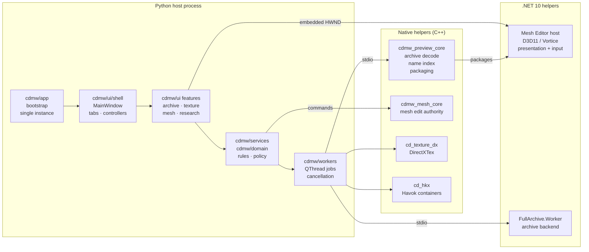
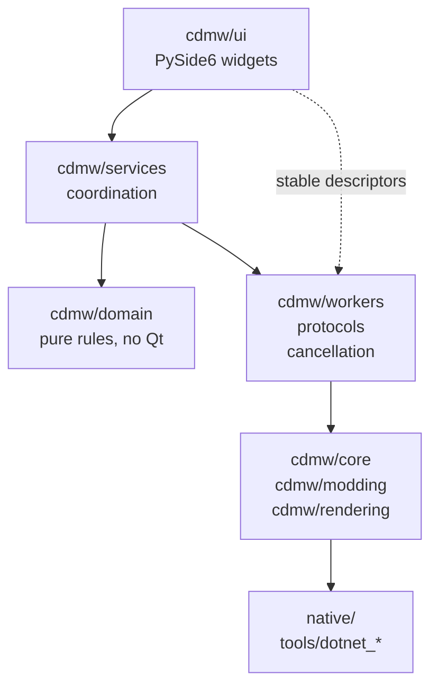
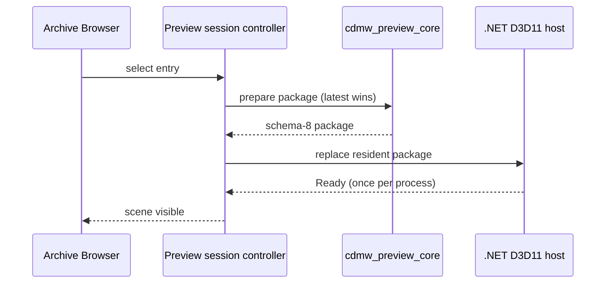
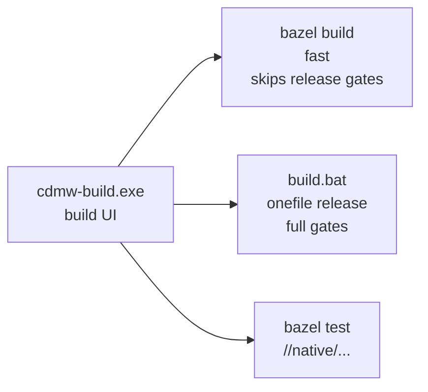

# Crimson Desert Mod Workbench

[](https://github.com/Ratty123/CDMW-Full/actions/workflows/windows-build.yml)


[](LICENSE)

A Windows desktop workbench for modding **Crimson Desert**: browse and extract
game archives, preview and edit meshes on a native D3D11 renderer, rebuild and
author DDS textures, assemble material and mesh replacement packages, and read
formats that had to be reverse engineered from the shipped build.

This is the full workbench. If you only need to look inside the archives, the
read-only companion app [**CDMW Lite**](https://github.com/Ratty123/CDMW-Lite)
is smaller and safer to hand to someone who is not modding.

| | |
|---|---|
| **Download** | [Releases](https://github.com/Ratty123/CDMW-Full/releases) |
| **Changelog** | [CHANGELOG.md](CHANGELOG.md) |
| **Architecture** | [docs/architecture.md](docs/architecture.md) |
| **Format status** | [docs/features/format-decode-progress.md](docs/features/format-decode-progress.md) |
| **Contributing** | [CONTRIBUTING.md](CONTRIBUTING.md) · [SECURITY.md](SECURITY.md) |

> `0.11.0-alpha.2` is the current source version and has not been published as a
> release yet. The newest build on the Releases page is `0.10.0-alpha.2`.

---

## Contents

- [What it does](#what-it-does)
- [File format decoding status](#file-format-decoding-status)
- [Architecture](#architecture)
- [Install](#install)
- [Build from source](#build-from-source)
- [Project layout](#project-layout)
- [Safety model](#safety-model)
- [Privacy](#privacy)
- [Known limitations](#known-limitations)
- [License](#license)

---

## What it does

| Workspace | What you can do |
|---|---|
| **Archive Browser** | Browse `.pamt` / `.paz` archives in flat or tree view with filters, search, cache reuse, extraction, text and media preview, and explicit patch/restore flows. |
| **Mesh Preview & Editor** | Preview `.pam`, `.pamlod`, and `.pac` meshes on the native D3D11 path with the game's layered materials composited as layers, inspect referenced textures, edit resident meshes through the native edit core, with OBJ/FBX export and OBJ/DAE/glTF/GLB import preview. |
| **Texture Workflow** | Rebuild DDS with the bundled `cd-texture-dx.exe` native DirectXTex helper, upscale through Real-ESRGAN NCNN or chaiNNer, plan texture policy, compare before/after, and export mod packages. |
| **Texture Replacer** | Replace edited PNG/DDS textures using the original game DDS as rebuild authority, with package-prefixed loose output and manager metadata. |
| **Image Editor** | Edit visible textures in-app: layered projects, selections, masks, adjustment layers, channel locks, brush tools, clone/heal, smudge, sharpen, soften, flattened PNG export. Finished work goes to `Texture Replacer` or `Icon Creator` from the Send To menu. |
| **Material Authority** | Build and audit material/mesh replacement packages with source-owned material routing, runtime XML preservation, diagnostics, and final package preview. |
| **Placement & Animation Studio** | Move where a weapon or piece of armour sits, re-route it to a different socket from the viewport, retarget draw/stow animations, and package the result for CDUMM, DMM, or JMM. |
| **Format Explorer** | What every game file format can and cannot do, and which tool does it, read from the same capability manifest the [decoding status](#file-format-decoding-status) below is generated from, so it cannot drift from what the code actually supports. |
| **Supporting tools** | Model Library, Icon Creator, Recolor Variants, Texture Research, Text Search, Retrofit/Repackage, settings/profile export, diagnostic bundles, detachable tabs. |

### Placement & Animation Studio

Where a weapon hangs, which socket it routes to, and which clip plays when it is
drawn are all editable, and none of it requires decoding a Havok tagfile. Four
mechanisms cover everything the hand-built, in-game-verified mods do: socket
transform edits and descriptor routing edits in XML, same-length socket-name
retargets inside `.paac`, and whole-file substitution of `.paa` and
`.motionblending` payloads that already exist elsewhere in the game.

The safety model is the operation vocabulary rather than a validation pass bolted
on afterwards: unsafe operations are not expressible. The editor emits socket
translate/rotate within configured bounds, routing changes to sockets that
already exist, descriptor alias pairs that must stay byte-identical, length-
preserving `.paac` retargets, and verified payload substitution. It refuses, with
an explanation and never a silent fallback, any binary write that changes file
length, PAAC graph structure edits, `ItemInfo`/`EquipSlot`/prefab-tree edits, a
socket name that does not already exist in the target's socket set, and authoring
new `.paa` keyframe data.

That envelope is not asserted, it is measured. A ground-truth harness derives an
operation list from each known-good mod and replays it against a pinned vanilla
baseline: 20 of 20 mods express as 6,416 operations, 15 of 15 vanilla-based mods
reproduce byte-identically, and composing the 1H and 2H operation lists yields
the combined mod. `.paac` strings are length-prefixed (`<len+1><ASCII><NUL>`),
verified 30 of 30 across the corpus, which is what makes a same-length retarget
provably safe rather than folklore.

Open it from the **Placement & Animation Studio** tab, or standalone with
`python scripts/placement_studio.py`. 163 unit tests cover it and none need a
game install.

---

## File format decoding status

Crimson Desert ships 141 distinct file extensions. 89 of them are engine formats,
either Pearl Abyss's own or licensed middleware, and **77 of those actually appear
in the shipped build**. That last number is the honest denominator: a format the
game does not contain cannot be modded and should not count against progress.

| Scope | Formats | Read coverage | Write coverage |
|---|---:|---:|---:|
| **Engine formats the build ships** | 77 | **41.7%** | **26.0%** |
| Weighted by archive file count | 1,383,187 files | 65.9% | 53.8% |
| Engine formats (proprietary + middleware) | 89 | 41.9% | 27.5% |
| Pearl Abyss formats only | 82 | 42.6% | 28.0% |
| All formats, open ones included | 141 | 54.3% | 33.0% |

Coverage is a weighted mean rather than a file count. Read: `full` = 1.0,
`partial` = 0.6, `surface` = 0.3, `none` = 0.0. Write: `full` = 1.0,
`constrained` = 0.5, `none` = 0.0.

### By area

| Area | Formats | Read | Write |
|---|---:|---|---|
| `user_interface_text` | 15 | `██████████████████░░` 88.7% | `████████████████░░░░` 80.0% |
| `texture_image` | 12 | `████████████████░░░░` 80.0% | `███░░░░░░░░░░░░░░░░░` 16.7% |
| `model_mesh_physics` | 19 | `███████████░░░░░░░░░` 54.2% | `███████░░░░░░░░░░░░░` 36.8% |
| `audio_video` | 18 | `█████████░░░░░░░░░░░` 47.2% | `██░░░░░░░░░░░░░░░░░░` 8.3% |
| `material_metadata` | 62 | `█████████░░░░░░░░░░░` 46.0% | `███████░░░░░░░░░░░░░` 33.1% |
| `animation_scene` | 15 | `████████░░░░░░░░░░░░` 42.0% | `█████░░░░░░░░░░░░░░░` 23.3% |

### What is finished

These read and write completely, and are the formats the modding workflows are
built on:

`.pac` · `.pam` · `.pamlod` · `.pami` · `.paa` · `.paloc` · `.papr` ·
`.paprojdesc` · `.pac_xml` · `.pam_xml` · `.pamlod_xml` · `.prefabdata_xml` ·
`.material` · `.mi` · `.pas` · `.pma` · `.spline` · `.spline2d` · `.app_xml`

Meshes, skeletal animation, textures, materials, and every line of localized
text in the game round-trip byte for byte. `.papr` closed most recently: all
twenty shipped jiggle/cloth rigs now tile to their declared entry counts and
rebuild exactly, across 2,737 configuration blocks.

### What is partly decoded

| Format | Files | Read | Write | What is left |
|---|---:|---|---|---|
| `.prefab` | 47,343 | partial | constrained | 38% of archive prefabs do not walk to completion. Component identity is not stated at the failure sites, and the collection-header width rule is ambiguous at 87% of them. Value editing is scoped to objects whose type the file states; whole objects can be duplicated or removed. |
| `.hkx` | 58,031 | partial | constrained | Structural edits (topology, counts, references, strings, arrays) are blocked pending semantic rebuild proof. No new collision shapes or ragdoll bodies. |
| `.paac` | 520 | partial | constrained | The chart node structure around the strings is not parsed, so only same-length animation retargets are allowed. |
| `.wem` | 375,762 | partial | constrained | Only uncompressed PCM is re-encoded; Vorbis/Opus streams cannot be authored. |
| `.pat` | 1,397 | partial | none | No builder, and LOD1+ plus unrecognised vertex layouts stay undecoded, so static world geometry is view-only. |
| `.parg` `.pasg` `.pcg` | 882 | partial | none | The pointer-addressed heap walk stops at the pointee trailer, so nested values are not read. Closing `.parg` opens VFX modding; closing `.pcg` allows custom collision hulls. |
| `.pab` | 257 | partial | none | Unknown and truncated variants fall back to a best-effort scan, and there is no writer, so bones cannot be added, removed, or renamed. |

### What is still closed

The highest-value gaps, in the order they would pay off:

- **`.palevel` / `.levelinfo`** (35,597 files): placement records are not parsed,
  so level layout cannot be edited.
- **`.paseq` / `.paseqc` / `.pastage`** (10,947 files): track and event layout is
  not parsed, so cutscene authoring is closed.
- **`.pae` / `.paem`** (6,669 files): parameter tables are not parsed, so VFX
  authoring is closed.
- **`.meshinfo`** (35,310 files): count/offset tables are unproven, which is why
  mesh replacement treats it as read-only; physics bounds and socket context
  cannot be edited.
- **`.paschedule` / `.paschedulepath`** (7,756 files): NPC routines cannot be
  retimed or rerouted.
- **`.bnk`** (3,186 files): HIRC event/action tables are not parsed, so sounds
  can be swapped but not added.
- **`.padxil`** (89,824 files): the shader bytecode is catalogued but not
  disassembled here, and there is no route to recompile an edited shader back
  into the cache.

A handful of entries (`.save`, `.binarystring`, `.paseqh`, `.paasmt`,
`.questgaugecount`, `.linkedsceneobject`) are encrypted with a key the project
does not have. Nothing can be decoded there until that is solved.

> The tables above are generated from
> [`schemas/archive_content_capabilities.v1.json`](schemas/archive_content_capabilities.v1.json)
> by `tools/report_format_decode_progress.py`, so the status a modder reads and
> the status the Archive Browser reports cannot disagree. The full per-format
> breakdown, including the evidence behind each rejected hypothesis, is in
> [docs/features/format-decode-progress.md](docs/features/format-decode-progress.md).

---

## Architecture

The workbench is one Python process that owns the UI and the domain rules, plus
verified helper processes that own everything performance- or platform-critical.
No surface silently falls back to a different renderer or a slower path: a
helper that cannot do the job reports an explicit unavailable state.



### Layering rules

Imports point one way. A layer may use the one below it and never the one above.



`cdmw/ui` is the only layer allowed to import PySide6 widgets. Everything below
it is testable without a running Qt application.

`MainWindow` has only `QMainWindow` as a direct base. Feature behaviour is
registered through stable descriptors bound to the window rather than through
new window base classes, so call sites stay put while implementation owners are
extracted. New behaviour belongs in a focused controller.

### Mesh preview and editing

One controller owns one verified helper process, with monotonic process and
package generations so a stale result can never be shown.



A replacement prepares while the accepted scene stays on screen, so switching
entries never blanks the viewport. Package and material failures are retryable
and never recycle a healthy process; only process, device, provenance, or
protocol failure enters recovery.

The `preview` profile exposes read-only presentation, picking, overlays, and
capture. The `authoring` profile adds the Mesh Editor mutation protocol and
rehydrates from authoritative `MeshService` state after a recovery. `Edit Mesh`
changes mutation permission; it does not choose or restart the renderer.

### Build system

Two build paths, both supported, driven from one UI:



Bazel builds the shipped executable end to end: all five native C++ helpers,
both self-contained .NET publishes, and the PyInstaller package. It is additive,
so the PowerShell release path is untouched and still owns the release gates. Bazel is installed repo-locally in `.tools/bazel/`; there is no
system-wide install. See [docs/bazel-migration.md](docs/bazel-migration.md).

---

## Install

1. Download the latest Windows portable EXE from
   [Releases](https://github.com/Ratty123/CDMW-Full/releases).
2. Run `CrimsonDesertModWorkbench-<version>-windows-portable.exe`.
3. In **Texture Workflow → Setup**, initialize a workspace and configure roots.
4. DDS preview, staging, and rebuild use the bundled `cd-texture-dx.exe` helper
   automatically. Configure optional upscaling tools only if you need them:
   - **Real-ESRGAN NCNN** for direct upscaling
   - **chaiNNer** for existing `.chn` chains

Portable config is stored beside the EXE. App-managed folders live under
`workspace/`: original DDS files, staging, outputs, extracts, libraries, tools,
cache, logs, sessions, projects, and research data.

---

## Build from source

**Requirements:** Windows 11 x64, Python 3.11 or 3.14 (the two release-tested
interpreters), PowerShell, .NET 10 SDK, and a CMake/MSVC toolchain for the
native helpers.

```powershell
python -m venv .venv
.\.venv\Scripts\python.exe -m pip install "pip==25.3"
.\.venv\Scripts\python.exe -m pip install -c constraints-release.txt -r requirements-build.txt
.\.venv\Scripts\python.exe -m pip install "pytest==9.0.3"
.\.venv\Scripts\python.exe scripts\verify_release_dependencies.py
```

Run the tests (578 test modules covering behaviour, protocol contracts, and
source guards):

```powershell
.\.venv\Scripts\python.exe -m pytest
```

Run the app from source:

```powershell
.\.venv\Scripts\python.exe cdmw_app.py
```

Build a publishable onefile EXE:

```powershell
powershell -NoProfile -ExecutionPolicy Bypass -File .\build_pyside6_app.ps1 -Mode onefile -BuildProfile release
```

Release builds require the exact versions in `constraints-release.txt`, publish
the bundled .NET Mesh Editor as a self-contained `win-x64` single file, and run
an offscreen startup smoke. Output is published only after the atomic result
marker reports `post_construction`:

```text
dist\CrimsonDesertModWorkbench-<version>-windows-portable.exe
```

Other entry points:

| Command | Result |
|---|---|
| `build.bat onefile release` | Same as above, through the batch wrapper |
| `build.bat onedir release` | Folder package instead of a single file |
| `build.bat` | Graphical build picker |
| `bazel build //:CrimsonDesertModWorkbench` | Fast Bazel build, no release gates |
| `bazel test //native/...` | Native helper unit tests |

### Bazel and the build UI

Both are optional, and neither is in the repository: `.tools/` is gitignored, so
a fresh clone will not have them. The PowerShell release path above needs
neither.

**Bazel** is not vendored. Install [bazelisk](https://github.com/bazelbuild/bazelisk)
and either put it on `PATH` or drop it at `.tools\bazel\bazel.exe`. The build UI
prefers the repo-local copy and falls back to `PATH`, so the version in
`.bazelversion` is what gets used either way. `BAZEL_VC` must point at the VC
directory if Bazel cannot detect MSVC on its own.

**The build UI** is built from source in this repository:

```powershell
dotnet publish tools\dotnet_bazel_launcher\Cdmw.BazelLauncher.csproj -c Release -o .tools\build-ui
```

That produces `.tools\build-ui\cdmw-build.exe`, a WinForms front end covering
both build paths: `bazel build //:CrimsonDesertModWorkbench` for a fast build,
and `build.bat onefile release` for the gated release. It finds the workspace by
walking up for `MODULE.bazel` and sets `BAZEL_VC` itself. See
[docs/bazel-migration.md](docs/bazel-migration.md).

---

## Project layout

```text
cdmw/                    application code
  app/                   bootstrap, startup routing, single-instance handling
  ui/shell/              MainWindow, tabs, controllers, close/diagnostics
  ui/<feature>/          archive browser, texture workflow, mesh editor, research
  ui/preview/            shared Qt host and resident preview session controller
  services/              coordination boundaries, no PySide widget imports
  domain/                pure rules: archive safety, texture policy, manifests
  workers/               worker protocols, result types, cancellation
  core/ modding/ rendering/   archive, DDS, import/export, packaging logic
native/                  C++ helpers (preview core, mesh core, texture, hkx)
tools/                   .NET 10 helper sources, audit and research scripts
tools/dotnet_*           D3D11 host, archive worker, build UI -- all source
schemas/                 versioned capability and package schemas
tests/                   behaviour, protocol contract, and source-guard tests
docs/                    guides, runbooks, and reverse-engineering notes
```

Note the two similarly named directories. **`tools/`** is source and is in the
repository. **`.tools/`**, with the dot, is gitignored and holds downloaded or
locally built binaries: bazelisk, the published build UI, RenderDoc, vgmstream,
the Havok CLIs. Nothing in it is tracked, and nothing in the release build needs
it.

Further reading: [Architecture](docs/architecture.md) ·
[Docs index](docs/README.md) · [Startup flow](docs/runbooks/startup-flow.md) ·
[Worker lifecycle](docs/runbooks/worker-lifecycle.md) ·
[Archive safety model](docs/features/archive-safety-model.md)

---

## Safety model

Archive mutation is explicit. Browsing, previewing, extracting, scanning, and
package building never silently rewrite game archives. Supported archive patch
flows use confirmation, preflight checks, backups, and restore support.

Keep local game archives, extracted assets, DDS payloads, build output, crash
reports, restore points, and corpus data out of source control.

## Privacy

No telemetry, analytics, auto-update checks, or background network calls during
normal offline use. Crash reports and diagnostic bundles stay local until you
export and share them. External pages open only from explicit user actions such
as download or help links.

## Known limitations

**Placement editing is deliberately bounded.** The operations listed under
[Placement & Animation Studio](#placement--animation-studio) are the whole
vocabulary. Anything outside it (full PAAC graph swaps, `ItemInfo`/`EquipSlot`
edits, new keyframe data, any binary write that changes file length) is out of
scope by design rather than a feature gap, and the editor refuses it with an
explanation. An earlier `Weapon Placement Studio` made those operations
expressible and was pulled for hanging the game; its menu entries in the Archive
Browser are left disabled and untouched, so nothing inherits the name or the code
path of the feature that crashed.

**Mesh rebuild is LOD0-only.** `.pamlod` LOD1+ can be read but not re-authored,
and `.meshinfo` is treated as read-only because its count/offset tables are
unproven, so physics bounds and socket context cannot be edited.

**Level layout, cutscenes, and VFX are read-only.** See
[what is still closed](#what-is-still-closed) for the formats behind that and the
order in which closing them would pay off.

## License

[MIT](LICENSE). Third-party components and their licenses are listed in
[THIRD_PARTY_NOTICES.md](THIRD_PARTY_NOTICES.md).
