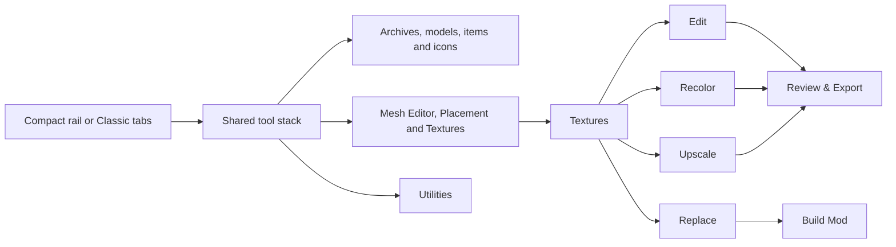
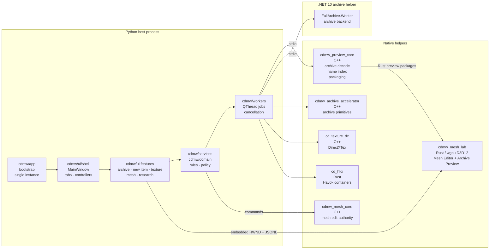
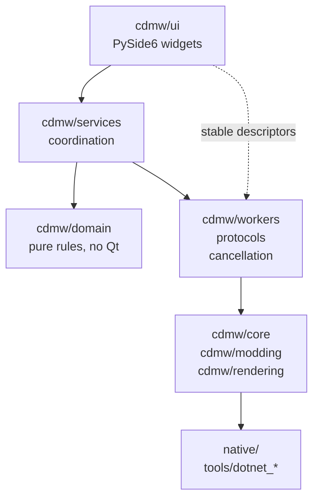
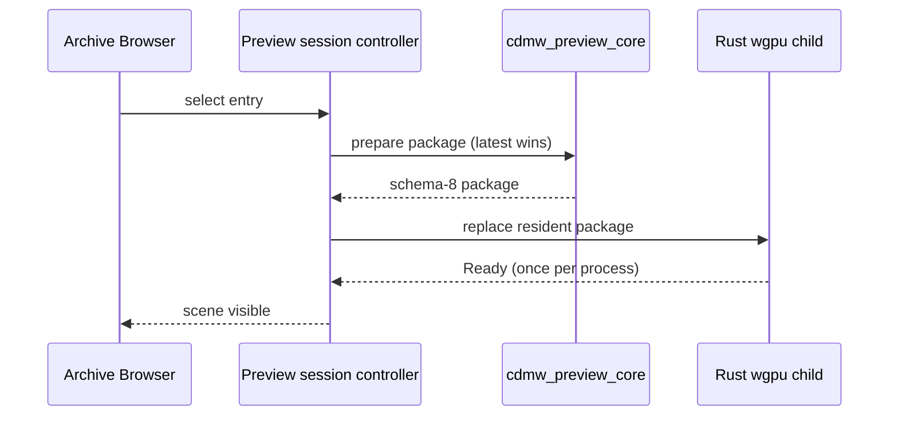

# Crimson Desert Mod Workbench

[](https://github.com/Ratty123/CDMW-Full/actions/workflows/windows-build.yml)


[](LICENSE)

A Windows desktop workbench for modding **Crimson Desert**: browse and extract
game archives, create equipment items, edit meshes and preview assets through
the embedded native Rust/D3D12 workspace,
place and customize visual effects, rebuild and author DDS
textures, assemble replacement packages, and read formats that had to be
reverse engineered from the shipped build.

This is the full workbench. If you only need to look inside the archives, the
read-only companion app [**CDMW Lite**](https://github.com/Ratty123/CDMW-Lite)
is smaller and safer to hand to someone who is not modding.

| | |
|---|---|
| **Download** | [Releases](https://github.com/Ratty123/CDMW-Full/releases) |
| **Changelog** | [CHANGELOG.md](CHANGELOG.md) |
| **Format status** | `schemas/archive_content_capabilities.v1.json` |
| **Contributing** | [CONTRIBUTING.md](CONTRIBUTING.md) · [SECURITY.md](SECURITY.md) |

> `0.11.0-alpha.16` is the current source version and is offered as a pre-release.
> See [Releases](https://github.com/Ratty123/CDMW-Full/releases) for downloads.

---

## Contents

- [What it does](#what-it-does)
- [Documentation and languages](#documentation-and-languages)
- [Bulk texture replacement](#bulk-texture-replacement)
- [Create New Item](#create-new-item)
- [Mesh Editor](#mesh-editor)
- [Placement & Animations](#placement--animations)
- [File format decoding status](#file-format-decoding-status)
- [Architecture](#architecture)
- [Install](#install)
- [Build from source](#build-from-source)
- [Project layout](#project-layout)
- [Safety model](#safety-model)
- [Privacy](#privacy)
- [Known limitations](#known-limitations)
- [License](#license)

---

## What it does

CDMW exposes 12 tools. **Create New Item** creates equipment without overwriting
its shipped template. Archive Browser, Mesh Editor, Placement & Animations, and
Textures cover inspection and replacement work.

Compact is the native, first-run layout. Classic remains available in
**Settings > Appearance > Layout**. Both use one tool registry and one content
stack; only navigation changes. Existing saved layout choices remain authoritative.
Most tools can be detached and reattached without replacing their widgets or state.



**Authoring > Textures** keeps one asset list and canvas across Edit, Recolor, and Upscale.
Documents retain their layers, history, selection, original DDS, and target binding.
**Replace** provides its own folder import, original matching and mod build controls.
Review & Export contains native DDS/PNG/project export, a shortcut to Replace,
recolor packages, and upscale output. Ambiguous originals need an explicit match.
Batch jobs stage their output and publish it only after success, preserving earlier
results on cancellation or failure. Recolor accepts loose mod folders and ZIPs,
including supported material-color sidecars and manager profiles.

| Workspace | What you can do |
|---|---|
| **Create New Item** | Create a new equipment identity through a guided seven-step workflow: choose and preview a shipped template, import and place a model, author its icon, stats, prices, perks and visual effect, choose distribution, review the exact file plan, then export a mod folder or install an overlay. Merge compatible mod folders into one DMM package. The template is read as a baseline and is never silently overwritten. |
| **Archive Browser** | Browse `.pamt` / `.paz` archives in flat or tree view with filters, search, cache reuse, extraction, text and media preview, and explicit patch/restore flows. Body & Face Finder browses character bodies, heads, hair and facial details with thumbnails and an interactive preview. |
| **Model Library** | Scan and preview local or importable models, then send a selected model directly into Create New Item. |
| **Icon Creator** | Prepare item-icon source images and build compatible icon replacement packages. |
| **Mesh Editor** | Edit supported archive or local meshes with selection, transforms, sculpting, topology, UVs, layers, and Morph & Refit. Supports OBJ/FBX export, OBJ/DAE/glTF/GLB import. Load body and armor from archives and rebuild each asset separately in one mod. Exact/Free Edit controls explain their limits; Finish Edit Mesh validates the isolated session before accepting changes. |
| **Placement & Animations** | Move where a weapon or piece of armour sits, re-route it to a different socket from the viewport, retarget draw/stow animations, and package the result for CDUMM, DMM, or JMM. |
| **Textures** | Bulk-replace loose PNG/DDS folders through Replace, edit layered documents, recolor mod textures and supported material values, upscale selected assets, and export DDS, PNG, projects, or mod packages from one workspace. |
| **Retrofit/Repackage** | Inspect and normalize an existing loose mod for the supported manager layouts without mutating shipped game archives. |
| **Format Explorer** | What every game file format can and cannot do, and which tool does it, with editing limits and evidence from the maintained [capability manifest](schemas/archive_content_capabilities.v1.json). |
| **Translations** | Edit language catalogue entries with reference-language context and export reviewed translation data. |
| **Research** | Inspect grouped texture families, unknown classifications, references, DDS analysis, reports, and local research notes. |
| **Text Search** | Search archive or loose text-like assets such as XML, JSON, CFG, and Lua with preview and export. |

## Documentation and languages

Open **Help > Documentation** for the 35-topic wiki, grouped index, topic links,
and search with **Ctrl+K**. **Help > About** provides the app overview, license,
and third-party notices. This README is also bundled with the application.

**Settings > Appearance** selects from 14 interface languages or imports a custom
language pack. The PySide interface and documentation use those catalogs. The
embedded Rust Mesh Editor currently has English-only controls. **Translations**
edits the game's PALOC text separately from the app's interface language.

## Bulk texture replacement

Use **Authoring > Textures > Replace** for textures edited outside the workbench.

1. Load the game archives, then use **Open Folder** to select the folder of edited
   PNG/DDS files. Subfolders are included and a successful load replaces the batch.
2. Under **Auto-Match originals**, choose **Game archives** and click **Auto-Match**.
   Files with unique original names can match without preserving archive folders.
   Ambiguous or missing matches need an explicit original before building.
3. Review the included files and package settings, then use **Build Mod**.
4. After editing the files externally, use **Reload Folder**, run **Auto-Match**
   again, and rebuild. Reload includes changed, added and removed files.

**Add Files** appends to the batch. **Remove Selected** and **Clear All** remove
queue entries without deleting files. Imports do not open every texture in the
editor; **Open in Editor** opens only the file you choose. Failed or cancelled
folder loads retain the previous batch, and failed builds retain earlier output.

To match against extracted originals, choose **Local DDS folder** and use
**Choose Folder...** to select that whole folder. Each Auto-Match rescans it,
including subfolders. **Choose Local DDS...** and **Choose Archive DDS...** in
the **Selected file** row are overrides for one texture. Replacement package
builds read the source files and do not modify game archives.

## Create New Item

Create New Item creates a new equipment row from a shipped template; it never
silently overwrites the template. Search covers the internal name, every available localized
item name, numeric item key, and equipment type; result rows display English names
when available. Template and imported-model
previews use the same resident Rust D3D12 host and native Preview Core cache as the
Archive Browser. Imported glTF, GLB, OBJ, DAE, and converted-FBX materials arrive
as one complete direct-texture package, preserve their vertical texture orientation,
and do not trigger a duplicate PAC-material pass. Use **Apply placement** before
**Build plan**; failed builds remain explained beside Apply and in Output. Tiled
materials retain their repeating textures in separate material slots. Placement aligns elongated models
from their principal axes instead of only trying right-angle rotations; its muted
depth-tested grid, distinct reference wire, and labelled red X, green Y, and blue Z
gizmo remain resident while numeric and gizmo movement update in place. Model
placement, icon capture, the enhancement ladder, base prices,
Abyss Gear perks, model variants and dye assignments, shops, crafting recipes,
supported reward sources, item groups, and the final file plan remain explicit.
Valid template socket bindings are preserved; changed skin bindings require a
compatible rig. Imported-model dyes are off by default; enable and map compatible
template dyes explicitly. A mesh
section may contain at most 65,535 vertices. A successful plan or game startup
does not establish equipping, appearance, or gameplay behavior in a save.

Armour imports can transfer weights across template material sections or use a
verified matching character body. Disable template physics for body-weight
transfer, then review the named donor and deformation warnings in Build plan.
Source materials retain separate surface and glow maps, colour factors and
opacity. Unsupported shader behavior is reported; existing exports must be
rebuilt to receive the material corrections in this version.

**Set price to 1 Copper** sets base and enhancement prices to one and creates
zero-price copies of embedded perks, retaining their bonuses and localized names.
It adds a Copper price even when the template is priced only in another currency.
**Include perk value in shop price** restores their normal price contributions.
The shop may still apply its own modifiers.

Effects are visual-only authoring. CDMW can decode `.pae` and `.paem` completely,
clone compatible fixed-layout effect data, edit fixed-size colour, brightness,
particle-size, spawn-rate and lifetime values, and show an explicitly approximate
particle preview against the selected item and a preview-only Kliff or Damian
reference. The preview does not reproduce the game's GPU vector fields, post
effects, animation clipping, or final gameplay appearance.
Colour edits include cloned render-preset temperature ramps. Billboard particle
size represents its full dimensions, with placement scale applied once.

Output can be a manager package or a CDMW-owned archive-group overlay. New Item
installs through overlays only. **Output → Merge mods** combines compatible mod
folders into a new DMM package after checking their contents and recorded game
baselines. Duplicate item or recipe IDs, conflicting edits and unsupported shared
changes block export; IDs are not reassigned automatically. Enable the combined
package in DMM in place of its source packages.
**Check mods for game updates...** compares a mod's recorded original files with
the current game, identifies changed dependencies and conflicts, and can write a
separate updated DMM package for supported changes. Missing original data or
unresolved conflicts block automatic updates. Source mods and game files stay
unchanged during comparison and export.
**Output → Installed overlays** lists individual
CDMW installs and removes a selected one while preserving the others. Shared
tables and registries are composed by record; conflicts and dependencies block
unsafe removal, including items used in another overlay's recipes. Earlier installs
without ownership history appear as one bundle. Their removal changes only texture
registrations with proven ownership and preserves later registrations from other mods.
After the last overlay is removed, the next install starts from the current game
files, so retired history does not block installation after a game update.
Keep `.cdmw/overlays.json` and `.cdmw/overlays/` with the game installation: they
retain the ownership and before/after history needed for individual removal. Retired
journals remain on disk, and a replaced inventory is retained in the install backup.
Planning and preview are read-only; game writes require service-owned preflight,
confirmation, verified backups and rollback. The part-prefab reader preserves both the original and
Crimson Desert 2.00.00 layouts byte-for-byte.

## Mesh Editor

Open a supported PAC, PAM, or PAMLOD from Archive Browser, or open a supported
local mesh. The embedded Rust `wgpu`/D3D12 editor keeps a disposable working
session with Undo/Redo. A missing or incompatible helper shows its failure and
Retry. Exact Game Asset preserves protected source records; Free Edit enables
supported topology changes for a new output. Disabled controls explain their
requirements. Textures remain read-only references in this workspace.

Use Select, Move, Rotate, Scale, Grab, Smooth, Inflate, Pinch, cleanup,
normals/tangents, UVs, and layers where the active mesh supports them. The Parts
list controls visibility and whole-part selection. Rig & Weights is temporarily
hidden from the product tool rail; its underlying implementation is retained.

The Parts panel also offers **Import Replacement…** and reversible **Mod**
inclusion. Imports keep their size and placement by default. Neutral-appearance
meshes provide **Try Experimental Replacement**, with a warning about possible
positioning, scale and animation errors. Use **Output Preview** before Finish
and Build Mod; required geometry and dependency checks remain active.

**Hair** adds Damiane presets, guide grooming, textured cards and head/shoulder
references. Hair edits support Undo/Redo, saved drafts and motion preview.
Additional barber choices can be exported as a separate mod package. In-game
selection, save/load, headgear and physics behavior still need testing.

**Morph & Refit** supports body shape sliders and fitting armor or clothing:

1. Use **Browse Body...** and **Browse Armor...** to load assets from the current
   archive catalogue, or **Use loaded mesh as body** to assign the open mesh.
2. Select the body Parts for shape sliders, then select and bind all garments
   that should follow the body. Align meshes with the normal transform tools
   when needed. The panel separates loaded assets, the driver, and bound garments.
3. Use **Fit to body** for an initial fit without a body slider. It applies
   Surface mode at 100% intensity with the current clearance, at least 0.1%.
   Inspect sleeves, underarms, cuffs, belts and layered trim before baking.
4. Adjust the shape sliders when needed. **Reset** or **Bake** the preview before changing
   its setup. Presets can be saved in the session library or exported as portable
   JSON; they require matching driver topology and Part order.
5. **Finish Edit Mesh** validates and retains the body and armor edits. **Build
   Mod** rebuilds each asset at its original archive path and publishes them
   together only after every asset succeeds. Hiding a Part does not exclude it
   from output.

Surface fitting keeps corrections local, preserves nearby clothing layers and
reduces inverted sleeves and cuff spikes. Large fits and subsequent slider
changes have a bounded 90-second command budget. Complex folds and thin trim can
still need manual adjustment. Undo a poor bake or reload the original meshes
before trying again.

Refit changes geometry; it does not automatically align poses or convert
skeletons, weights or animations. Check visual fit and animation clipping in
game. Export and mod-package creation leave shipped archives unchanged;
installation has its separate confirmation and recovery flow. See the
[Mesh Editor guide](cdmw/ui/mesh_editor/README.md) for controls, supported output,
rig requirements and preset behavior.

## Placement & Animations

Opening the Studio prepares the baseline, rig, meshes and archive relationships in
the background, using the current Game / Package path from Archive Locations.
If preparation fails, **Try again** reads the current path again. Equipment and
armour changes keep the last usable scene visible until the new selection is
ready; cancelled or superseded work cannot replace it.
Playback reuses bone lookup, bind-transform and mesh-topology data and projects
the skeleton in batches without reducing the displayed mesh detail.

The replacement workspace keeps equipment, linked parts, destination, animation
selection, comparison and checks together. Start with **Equipment**, **Placement**
and **Animation** on the left, then use **Prepare preview** above the comparison.
The window supports minimize, maximize and resizing; adjustable panes and expanding
target/replacement columns use the available space. **Details and exact files**
switches the file pane to review and back without losing the selection or shrinking
the preview. Review and apply share a compact footer. Each proposed file has an inspectable
target/donor mapping, Full/LOD variant, shared references and status. Manual donor
choices survive refreshes while valid. Select **Prepare preview** to resolve the
complete payload set before applying one operation; unreadable donors, invalid
payloads, conflicts and stale preparation block the operation without changing
the session.

**Before** includes earlier session edits. **After** uses a private copy with the
proposed operation. Both share camera, playback clock and controls; shorter tracks
hold their endpoint until that shared clock loops. The full selected animation set
is available for inspection. Export consumes the same
prepared effective files, excludes byte-identical selections and retains mappings,
hashes, companion decisions and check evidence in the compatible package manifest.
Older packages without this evidence display as unchecked.

Checks distinguish **Passed**, **Warning**, **Unverified** and **Blocked**. Packed
skeletal and root-motion channels use separate validated clocks; declared duration
controls seeking and looping. Installed animation sets, matching tables, explicit
defaults, Full/LOD companions, prefab socket bindings and reverse references guide
selection. Gameplay browsing starts with the selected rig; facial, additive, LOD,
equipment and NPC/story clips have separate filters. Attachment inspection includes
draw/stow clips associated through decoded part events, even when the attachment's
animation set uses a suffix or default mapping.

Supported attachment bindings reconstruct their own bone palette and bind pose.
Bow variants can identify unused leaf tracks through a validated mesh sharing their
animation set; witness paths and hashes are retained without borrowing its transforms.
Supported 1D/2D/3D blendspaces use stored triangulation and split planes, phase marks,
parameter scaling, parameter smoothing and weight smoothing. Controls expose raw
parameters, contributing clips, playback rate and **Restart blend** for spaces that
hold their initial weights. Stored character scale is distinct from playback rate.

**Chart events** applies decoded, unconditional draw/sheath socket handoffs at their
stored times. The initial Held/Stowed state remains a manual choice. Conflicting or
conditional timelines, unresolved sockets and unsupported events retain manual
inspection with an **Unverified** explanation. Before/After uses the target's charts;
copying an animation does not silently import the donor's event graph. Sources,
action indices and timestamps are available in the check details.

Destination measurements and actual skeleton proportions inform donor suitability
without certifying contact or engine retargeting. Automatic actor inputs, inherited
blend weights, runtime action conditions, some chart layouts and physics-generated
attachment palettes remain **Unverified**. Preview does not simulate engine IK or
physics. Structurally valid exports can retain these uncertainties; in-game behavior
requires a separate game test. The workflow does not write installed archives.

Open the **Placement & Animations** tab, or run
`python scripts/placement_studio.py`. Focused tests use repository fixtures;
installed-game inspection and visible validation are separate evidence.

---

## File format decoding status

Support is specific to an operation and its input. **Format Explorer** lists the
available tools, editing limits and recorded evidence for each format. Its
capability manifest is maintained alongside the code; a manifest claim does not
replace tests of the operation or validation against the target asset.

| Workflow | Supported operations | Limits |
|---|---|---|
| Textures | Edit PNG/DDS documents, recolor mod textures and material values, upscale, and export DDS or manager packages | DDS format, mip and semantic rules apply; replacement requires an identified original target. |
| Mesh Editor | Preview and capability-gated LOD0 authoring, review, validation and output | Individual tools report availability. Parser support does not establish every material, asset or GPU as verified. |
| Translations | Search and edit PALOC string records | Category IDs are preserved; the engine's category names are not known. |
| Prefabs | Inspect decoded objects and perform the supported typed edits | Some files cannot be walked completely; editing is limited to supported structures. |
| Physics / HKX | Read-only inspection; the backend retains bounded fixed-size editing support | HKX actions are temporarily absent from Tools and file context menus. New topology, collision shapes, ragdoll bodies and structural edits remain blocked. |
| Animation / PAA | Read and rebuild supported sampled and packed clips | Unmodelled fields are preserved; they cannot be authored from nothing. |
| Audio / WEM | Decode to WAV and rebuild PCM WEM | Vorbis and Opus streams cannot be authored. |

The [capability manifest](schemas/archive_content_capabilities.v1.json) records
per-format evidence and remaining work. The local contributor report generated by
`python tools/report_format_decode_progress.py --write` retains a weighted
research-progress heuristic. Those scores are not percentages of
supported operations, editable assets or verified game behavior.

---

## Architecture

The workbench is one Python process that owns the UI and the domain rules, plus
verified helper processes that own everything performance- or platform-critical.
The production preview and editor use one Rust renderer. Missing or incompatible
helpers report an unavailable state; they never switch to a different renderer.



### Layering rules

Imports point one way. A layer may use the one below it and never the one above.



`cdmw/ui` is the only layer allowed to import PySide6 widgets. Everything below
it is testable without a running Qt application.

`MainWindow` is implemented through the shell-owned `WorkbenchWindow`. The
public import remains a compatibility proxy. Shell and feature methods are
ordinary methods on their owning widgets and controllers; Archive and Textures
state belongs to those workspaces. Worker callbacks remain bound to their
owning QObject on the UI thread.

### Mesh preview and editing

One controller owns one verified helper process, with monotonic process and
package generations so a stale result can never be shown.



A replacement prepares while the accepted scene stays on screen, so switching
entries never blanks the viewport. Package and material failures are retryable
and never recycle a healthy process; only process, device, provenance, or
protocol failure enters recovery.

The `read_only` and `static_replacement` profiles expose presentation, picking,
overlays, capture, placement, and replacement interaction through the same
viewport-only Rust `wgpu`/D3D12 child used by every Archive Preview consumer.
Mesh Editor authoring uses the helper's complete UI, edits a disposable shadow
`MeshService`, and publishes only through validated Finish. A Rust failure never
switches to another renderer. See
[Mesh Editor integration guide](cdmw/ui/mesh_editor/README.md).

### Build system

`build.bat` is the supported build entry point. Run it without arguments to open
the graphical builder (`build_gui.py`), or pass a package type and profile for
automation. Both use `build_pyside6_app.ps1`, which owns native-helper preparation,
application packaging, and release checks.

---

## Install

1. Download the latest Windows portable EXE from
   [Releases](https://github.com/Ratty123/CDMW-Full/releases).
2. Run `CrimsonDesertModWorkbench-<version>-windows-portable.exe`.
3. Set your game folder in **Settings > Paths > Archive Locations**. For
   upscaling, open **Textures > Upscale** and configure the Original DDS, PNG,
   and Output roots.
4. DDS preview, staging, and rebuild use the bundled `cd-texture-dx.exe` helper
   automatically. Configure optional upscaling tools only if you need them:
   - **Real-ESRGAN NCNN** for direct upscaling
   - **chaiNNer** for existing `.chn` chains

Portable config is stored beside the EXE. App-managed folders live under
`workspace/`: original DDS files, staging, outputs, extracts, libraries, tools,
cache, logs, sessions, projects, and research data.

---

## Build from source

**Requirements:** Windows 11 x64, Python 3.11 or 3.14 (the two release-tested
interpreters), PowerShell, .NET 10 SDK, a CMake/MSVC C++ toolchain, and Rust
through rustup. The Rust workspace pins its MSVC toolchain in
[its toolchain file](tools/rust_mesh_lab/rust-toolchain.toml).

```powershell
python -m venv .venv
.\.venv\Scripts\python.exe -m pip install -c constraints-release.txt -r requirements-build.txt
.\.venv\Scripts\python.exe -m pip install "pytest==9.0.3"
.\.venv\Scripts\python.exe scripts\verify_release_dependencies.py
```

Prepare the required native helpers, archive worker, and Rust preview/editor
before running the app or tests from a fresh checkout:

```powershell
powershell -NoProfile -ExecutionPolicy Bypass -File .\build_pyside6_app.ps1 -NativeHelpersOnly -BuildProfile release
```

For an ordinary change, run its owning test file. The optional full nonvisual
suite covers behavior, protocol contracts, and source guards:

```powershell
.\scripts\codex_check.ps1 -Area full
```

Run the app from source:

```powershell
.\.venv\Scripts\python.exe cdmw_app.py
```

Build a publishable onefile EXE:

```powershell
.\build.bat onefile release
```

Release builds install the complete CPython 3.11/3.14 Windows x64 wheel graph
from the hash-checked `requirements-build.txt` lock, cross-check every version
against `constraints-release.txt`, build the shared Rust Mesh Editor and Archive
Preview runtime from its pinned Cargo lock, and run offscreen startup and D3D12
capture checks. The single Rust executable and its verified provenance are
packaged at `native/rust_mesh_editor/cdmw_mesh_lab.exe`; the separate .NET
full-archive worker remains packaged for catalogue/content work only.
Output is published only after the atomic result marker reports
`post_construction`:

```text
dist\CrimsonDesertModWorkbench-<version>-windows-portable.exe
```

Other entry points:

| Command | Result |
|---|---|
| `build.bat onedir release` | Folder package instead of a single file |
| `build.bat` | Graphical build picker |
| `build.bat onefile fast` | Incremental build for local iteration |
| `build.bat onefile debug` | Console-enabled build for troubleshooting |

Automation can also call `build_pyside6_app.ps1` directly with `-Mode` and
`-BuildProfile`. Run `build.bat help` for the available package types and profiles.

---

## Continuous integration

**Windows Build** runs automatically on pushes to `main`, version tags, and pull
requests, and can be started manually. There is no nightly schedule, so unchanged
code does not produce another daily run or failure notification.

Documentation and GitHub issue/pull-request template changes skip both Windows
Build and CodeQL on pushes and pull requests. A change that also includes code,
dependencies or build/workflow files still runs the checks. Version tags and
manual Windows builds remain explicit release routes.

CodeQL uses the [repository workflow](.github/workflows/codeql.yml), with GitHub's
automatic default setup disabled. It retains scans for Actions, C/C++, C#,
Python and Rust, a weekly security refresh, and manual runs.

Pushes, pull requests, version tags and default manual runs use a short `smoke`
suite on Python 3.14: startup, tool construction, archive confirmation/backup/
rollback, output path safety, helper cleanup, metadata and localization checks.
This route does not build native helpers. Select `exhaustive_tests` in a manual
run to build helpers and run the full suite on Python 3.11 and 3.14.
Packaging runs only for tags or manual dispatch after the selected checks pass.
The portable onefile EXE is the default; onedir or both remain manual choices.
Each package still verifies its helpers and startup. Visual and installed-game
tests stay outside CI. Run affected feature or native tests when changing those
features; the short suite does not replace that focused regression work.
See the [test guide](tests/README.md) and [workflow](.github/workflows/windows-build.yml).

## Project layout

```text
cdmw/                    application code
  app/                   bootstrap, startup routing, single-instance handling
  ui/shell/              MainWindow, tabs, controllers, close/diagnostics
  ui/shell/compact/      first-run rail layout around the same tool widgets
  ui/<feature>/          archive, new item, texture, mesh, research workspaces
  ui/preview/            shared Qt host and resident preview session controller
  services/              coordination boundaries, no PySide widget imports
  domain/                pure rules: archive safety, texture policy, manifests
  workers/               worker protocols, result types, cancellation
  core/ modding/ rendering/   archive, DDS, import/export, packaging logic
native/                  C++ helpers, Rust backends, staged Rust renderer/editor
tools/                   .NET 10 helpers, Rust Mesh Lab, audit and research source
tools/dotnet_*           archive worker source; old renderer is historical
schemas/                 versioned capability and package schemas
tests/                   behaviour, protocol contract, and source-guard tests
```

Note the two similarly named directories. **`tools/`** is source and is in the
repository. **`.tools/`**, with the dot, is gitignored and holds downloaded or
locally built binaries: RenderDoc, vgmstream, and the Havok CLIs.
Its generated contents are not tracked; build scripts locate or prepare
required helpers explicitly.

The guides, runbooks and reverse-engineering notes are working documents and
are kept outside this repository, so the paths they were once linked from are
deliberately absent here.

---

## Safety model

Archive mutation is explicit. Browsing, previewing, extracting, scanning, and
package building never silently rewrite game archives. Supported archive patch
flows use confirmation, preflight checks, backups, and restore support.

Overlay installs build a CDMW-owned archive group and mount-list entry rather
than rewriting shipped payload archives. They use the same service-owned
confirmation, staging, receipt, rollback, and restore boundary; UI code never
calls an archive writer directly.

Keep local game archives, extracted assets, DDS payloads, build output, crash
reports, restore points, and corpus data out of source control.

## Privacy

No telemetry, analytics, auto-update checks, or background network calls during
normal offline use. Crash reports and diagnostic bundles stay local until you
export and share them. External pages open only from explicit user actions such
as download or help links.

## Known limitations

**Placement editing is deliberately bounded.** The operations listed under
[Placement & Animations](#placement--animations) are the whole
vocabulary. Anything outside it (full PAAC graph swaps, `ItemInfo`/`EquipSlot`
edits, new keyframe data, any binary write that changes file length) is out of
scope by design rather than a feature gap, and the editor refuses it with an
explanation. An earlier `Weapon Placement Studio` made those operations
expressible and was pulled for hanging the game; its former HKX/placement menu entries are absent from the Archive Browser.
The dedicated Placement & Animations workspace owns the supported workflow.

**Exact game-asset rebuild remains LOD0-only.** `.pamlod` LOD1+ cannot be
published through the exact archive writer. Free Edit may author the active
higher LOD into a new validated OBJ/MTL destination while retaining the other
loaded LODs in the working session; it never presents that output as exact game
writeback. `.meshinfo` is treated as read-only because its count/offset tables
are unproven, so physics bounds and socket context cannot be edited.
Mesh Editor is therefore a constrained game-mesh authoring editor with
Blender-inspired controls, not a general modeller or a promise that every
registered backend action can be published into an exact game mesh.

**Level layout and cutscenes are read-only. Effect authoring is deliberately
bounded.** `.pae` / `.paem` look values can be edited only where the decoded
fixed-size layout preserves every offset, and references are renamed only at the
same byte length. The resident particle preview is an approximation, not a claim
of engine-identical simulation or in-game appearance. It renders the shipped
flame and lightning textures, packed smoke masks, animated sprite sheets and
decoded particle meshes, with authored colour, velocity, size and fading.
Game-only vector fields, collisions, lighting and distortion remain approximate;
procedural spawn shapes currently use the placed origin unless a spawn mesh is
available. See
[what is still closed](#what-is-still-closed) for the remaining formats and the
order in which closing them would pay off.

## License

[MIT](LICENSE). Third-party components and their licenses are listed in
[THIRD_PARTY_NOTICES.md](THIRD_PARTY_NOTICES.md).
