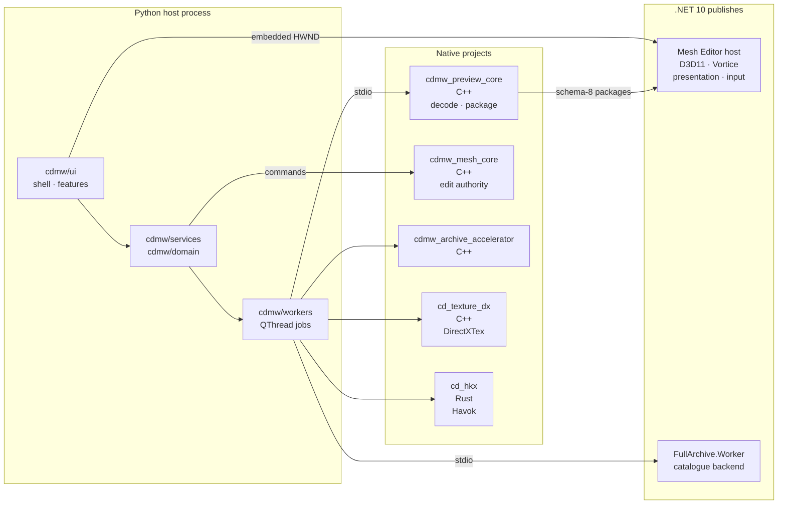
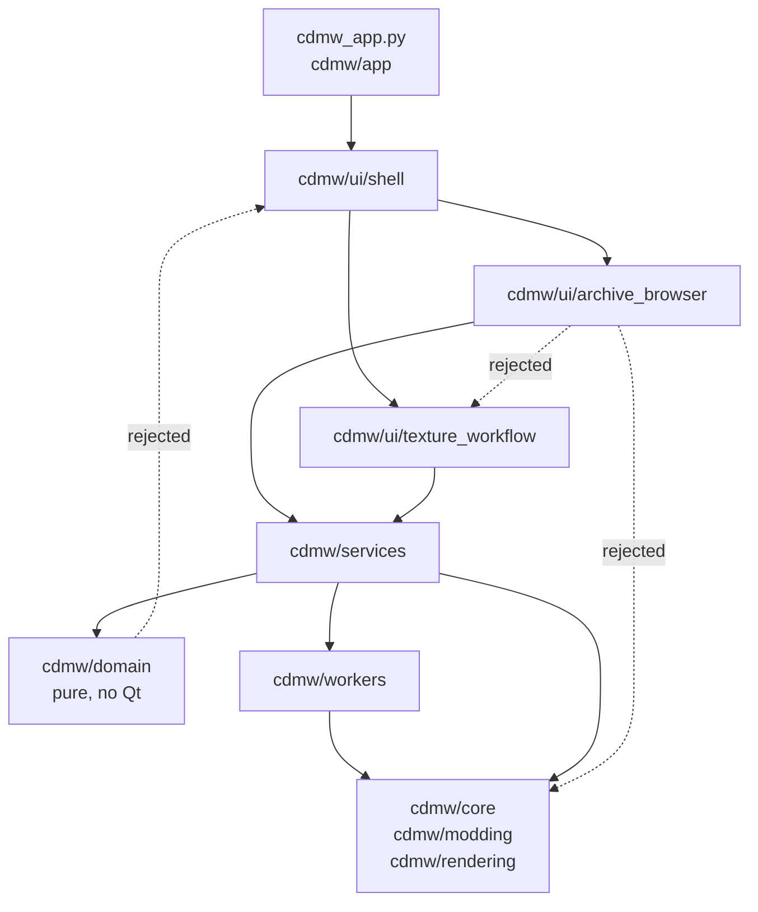
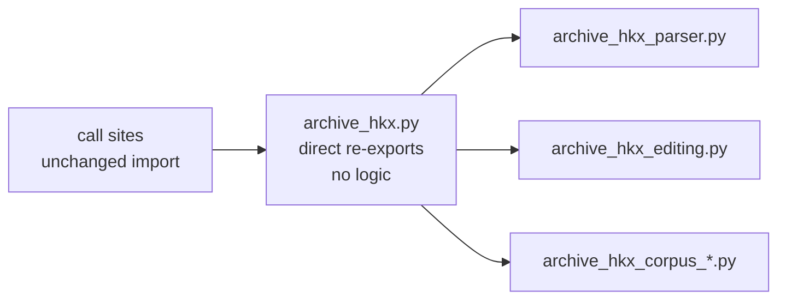
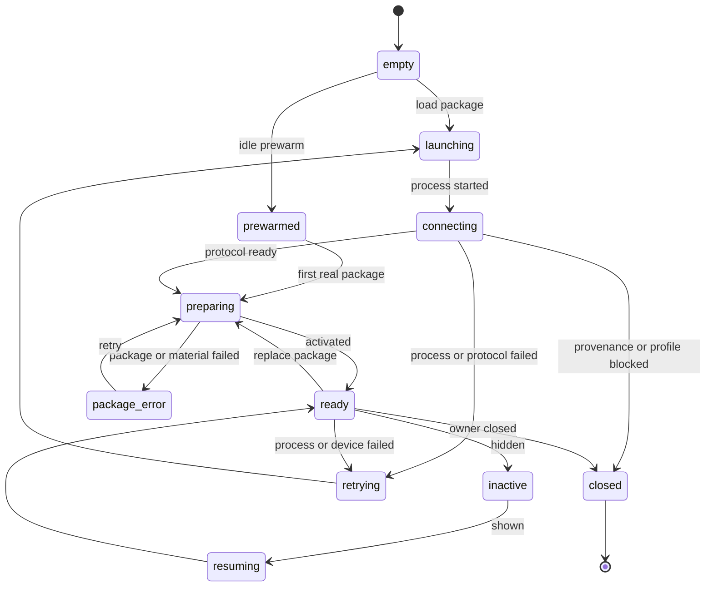
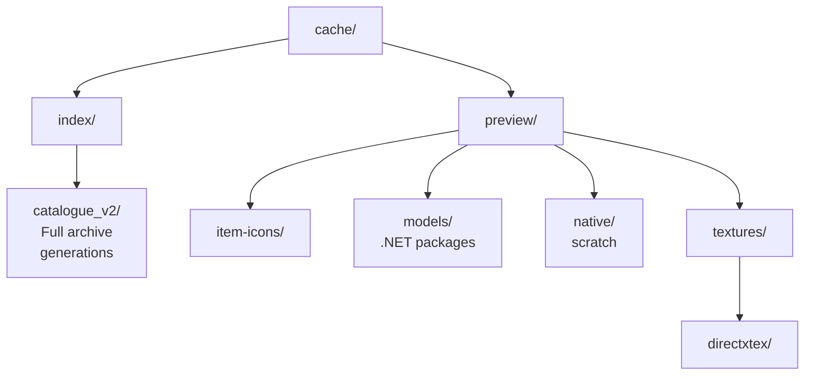
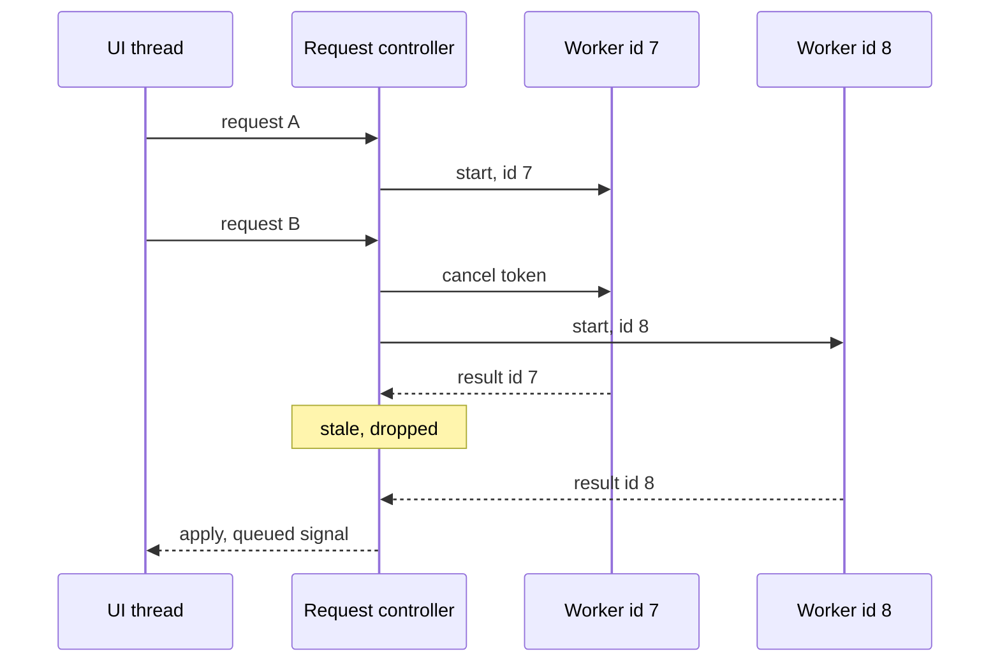
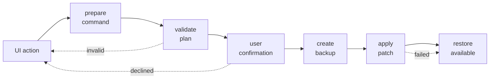

# Architecture

Crimson Desert Mod Workbench uses a composed PySide window with focused app,
shell, feature, service, domain, and worker packages. Public imports stay stable
behind compatibility wrappers.

This document is the contributor reference: search it for an ownership boundary,
a dependency rule, or a stable contract, and read that section. The README's
[Architecture](../README.md#architecture) section is the short reader-facing
version of the same system.

## System Shape

One Python process owns the UI and the domain rules. Everything
performance- or platform-critical lives in a verified helper process, and no
surface silently falls back to a different renderer or a slower path: a helper
that cannot do the job reports an explicit unavailable state.

Four of the native projects build through CMake and `cd_hkx` builds through
Cargo; a release compiles those and publishes the two self-contained .NET
helpers before it packages anything.

Three edges are the only route to what they reach, and each has a test that says
so. Archive writes reach the game only through `ArchiveMutationService`. Resident
mesh geometry changes only through `cdmw_mesh_core`. Every visible model preview
is drawn only by the .NET/Vortice host; the retired native renderer is forbidden
by source and release-package guards.

## Package Map

- `cdmw_app.py`: tiny command entrypoint.
- `cdmw/app/`: argument parsing, startup routing, single-instance handling,
  activation, splash startup, PyInstaller runtime cleanup, and bootstrap reports.
- `cdmw/ui/main_window.py`: compatibility facade for `MainWindow`, `run_gui`,
  and legacy public helpers.
- `cdmw/ui/shell/`: current GUI shell implementation, app context/state, tab
  registry, action/menu/status/theme/icon/activation ownership modules, and
  close/diagnostics helpers. `MainWindow` now has only `QMainWindow` as a direct
  base and owns shell, archive, texture, mesh, and activation controllers.
  `window_feature_providers.py` registers the legacy feature providers;
  `window_feature_controller.py` installs stable descriptors that bind those
  methods to the window, preserving call sites while implementation owners are
  extracted. Qt virtuals (`closeEvent`, `resizeEvent`, and `changeEvent`) use
  explicit class-body bridges into that controller. Lazy method callbacks are
  QObject-bound to preserve UI-thread signal delivery without importing the
  provider before first use. Its
  generated member manifest is refreshed automatically before packaging or
  manually with `scripts/generate_window_feature_provider_members.py`; the
  subsequent `--check` detects changed provider sources without importing the
  full UI graph. New behavior belongs in focused controllers, not new window
  bases.
- `cdmw/ui/<feature>/`: feature UI packages such as archive browser, texture
  workflow, mesh editor, model library, item icons, research, and text search.
- `cdmw/ui/tools/`: utility tools that do not belong to a feature workspace,
  currently Retrofit/Repackage Mods.
- `cdmw/domain/`: pure rules and policies for archive safety/selection/filter
  state, texture profiles/rules/semantics/policy/plans/validation, mesh session
  validation, research contracts/classification/note state, and package
  manifests/preflight.
- `cdmw/services/`: business coordination boundaries with no PySide widget
  imports.
- `cdmw/workers/`: shared worker protocols, result types, cancellation, and
  worker extraction points.
- `cdmw/core/`, `cdmw/modding/`, `cdmw/rendering/`: low-level archive, texture,
  rendering, import/export, and external tool logic.
- `native/cdmw_mesh_core/`: bundled C++ mesh-edit core for resident Mesh Editor
  sessions. Python service/modding boundaries dispatch commands and report
  explicit unavailable/error states instead of silently falling back when native
  editing is required. Its thin `main.cpp` delegates to bounded protocol,
  geometry, topology, interchange, report, preview, session, history, and
  service owners under `src/owners/`. CMake's named unity group preserves their
  shared private state and deterministic dependency order without source-level
  `.cpp` includes; every owner uses the 1,000-line default ceiling and every real
  function is capped at 150 lines.
- `native/cdmw_preview_core/`: native archive preview/package, name-index, and
  mesh-rebuild executable. Its five-line entry delegates to ordered protocol,
  archive decode/index, PAC/static geometry, material resolution/selection,
  package/cache payload, report, rebuild, name-index, and command owners under
  `src/owners/`. A named CMake unity group preserves the legacy private-type
  dependency order without source-level `.cpp` includes. Owners/functions are
  capped at 1,000/150 lines; executable names, commands, package schema, report
  fields, texture provenance, and no-fallback behavior remain compatible. It is
  a decode/package service and never owns a visible renderer.

- `cdmw/ui/preview/`: shared Qt host and resident session controller for every
  visible model preview. One controller owns one verified `QProcess`, monotonic
  process/package generations, latest-wins preparation, stale-result rejection,
  package leases, bounded shutdown, and visibility-scoped retry. The `preview`
  profile exposes read-only presentation, picking, overlays, resident package
  replacement, and capture; the `authoring` profile additionally exposes the
  Mesh Editor mutation protocol and rehydrates from authoritative MeshService
  state after recovery. Long-lived tabs deactivate and retain their process;
  modal owners terminate it on close. No surface falls back to another visual
  renderer. Package identity is resolved path plus material and scene
  signatures: repeating it is an activation-only no-op, duplicate `Ready`
  events are consumed once per process, and a replacement prepares while the
  accepted scene remains visible. Package/material failures are retryable and
  never recycle a healthy process; only process, device, provenance, or
  protocol failure enters process recovery. Idle procedural prewarm starts the
  helper asynchronously without consuming a user package generation.
- `tools/dotnet_mesh_editor_experiment/`: production presentation and input
  host for Archive Browser, reference/material/attachment previews, Model
  Library, static replacement/alignment, icon capture, and Mesh Editor. Its
  required renderer backend is the
  .NET/Vortice D3D11 path `d3d11_vortice_shader`; WPF/GDI rendering is available
  only through an explicit developer override. The resident C++ edit backend
  remains `cdmw_mesh_core_0.1`. One resident scene protocol owns editable and
  original-reference roles, Y-up grid, comparison mode, placement transform,
  and move/rotate/scale gizmo state. One shared parsed document and D3D resource
  owner backs simultaneous Original and Imported/Modify render rectangles in
  one Vortice viewport/swap chain. Each rectangle has its own role filter, grid,
  camera, and display state; a persisted draggable divider resizes them without
  duplicating geometry, materials, textures, devices, or helper processes. The
  Original rectangle is camera-only and Imported/Modify is the sole mutation
  authority. Their normal cameras remain independent; explicit Overlay is the
  single-surface comparison exception. `Edit Mesh` changes mutation permission;
  it does not choose or restart the renderer.
  Initial Archive and Mesh Editor packages are geometry-only. Schema-8 Preview
  Core packages are validated and adapted in place with atomic versioned
  `net_materials.json`, `dotnet_scene.json`, `mesh.cdmeta.json`, and marker
  sidecars; the base manifest and geometry buffers are never rewritten or
  quarantined for corrupt adapter data. Their renderer-ready native UVs enter
  the shared Wavefront-oriented document convention once, so the later upload
  conversion restores the original V coordinate before any explicit material
  flip policy is applied. Unsupported schemas alone use the compatibility
  OBJ/PNG converter. Texture resolution and material compilation
  happen later through the resident material/package protocols; lightweight
  resident material-state snapshots never run image synthesis or package I/O.
  Archive and editor surfaces consume the same `dotnet_scene.json`,
  `net_materials.json`, exact DDS resources, canonical material compiler, and
  atomic derived-package cache. Legacy `preview/d3d11_*` setting names and
  `native_preview_*` package APIs are compatibility storage/artifact aliases;
  they do not launch a renderer. The retired `cdmw-d3d11-preview.exe`, native
  project, HWND/WM_COPYDATA protocol, and packaged payload are forbidden by
  source and release-package guards.
- `tools/placement_studio/`, `tools/format_explorer/`, and
  `tools/translation_studio/`: user-facing tool tabs. Each exposes a `tab.py`
  widget that `cdmw/ui/shell/tool_tabs.py` registers as a lazy shell tool, so
  they are app surfaces rather than developer harnesses despite living under
  `tools/`. Their domain logic sits beside them (`catalogue.py`,
  `table_model.py`, and the placement studio's per-topic owners) over
  `cdmw/core/` format modules.
- `tools/paa_motion/`: read-only `.paa` motion clip reader. No UI; see
  `docs/features/paa-motion-format.md`.
- `tools/dotnet_bazel_launcher/`: build-time launcher used by the Bazel rules;
  it is not part of the running app.

These tool tabs follow the same layering as `cdmw/ui/`: the Qt module reads
nothing from `cdmw.core` itself, and takes its format types from the domain
module beside it (`window_constraints.py` through `constraints.py`,
`tab.py` through `catalogue.py`). `test_tool_tab_ui_modules_do_not_import_core_implementations`
enforces that, keyed on whether a module imports PySide6, because the general
import-boundary guards scope to `cdmw/` and would otherwise leave `tools/`
unchecked. A new feature tab still belongs in `cdmw/ui/<feature>/` behind a
service; these predate that rule and stay where they are.

Focused owner source files use a shared 1,000-line default ceiling. Smaller
feature-specific caps remain valid. A cohesive, static-data, or generated owner
may exceed the default only through an explicit per-file exception in its owning
architecture guard; existing larger files remain under the repository-wide
non-growth ratchet until reduced. The default real-function ceiling remains 150
lines.

## Layer Rules

Imports point one way. A layer may use the one below it and never the one above,
and the dotted edges below are the ones the import-boundary tests reject.

- Entry code imports `cdmw.app.bootstrap`, not feature tabs or core internals.
- App bootstrap does not import feature tab internals.
- UI shell can import PySide, feature tabs, services, and shared widgets.
- Feature UI packages do not import unrelated feature tabs.
- UI packages import domain contracts and service surfaces, never
  `cdmw.core`, `cdmw.modding`, or `cdmw.rendering` implementations directly.
- Services may import domain/core/modding/rendering but not PySide widgets.
- Domain modules must stay pure Python and must not import PySide.
- Workers must not mutate UI directly from background threads.
- UI must not directly own destructive archive mutation policy.

`cdmw.core.archive` and `cdmw.core.archive_modding` are public compatibility
surfaces only. Each name resolves through an explicit owner map, is cached on
first access, and has the same object identity in either import order. Core
implementation modules import focused owners directly; importing either facade
from `cdmw/core/` is an architecture-test failure.

UI archive operations cross focused service boundaries for reads, queries,
previews, extraction, and installation/cache environment work. UI imports of
either archive compatibility facade are forbidden, including relative imports.
Archive writes remain exclusive to `ArchiveMutationService`.

UI preview preparation uses `preview_workflow_service.py`; renderer, native
host, package-cache, and static-thumbnail access uses the cached lazy
`preview_rendering_service.py` surface. UI modules do not import
`cdmw.rendering` or the underlying core preview implementations directly.

Mesh/native and texture/recolor UI coordination crosses the cached lazy
`mesh_workflow_service.py` and `texture_workflow_service.py` surfaces. Focused
material-sidecar, text-search, Replace Assistant, HKX-edit, and startup-splash
services cover the remaining feature workflows. The repository-wide import
boundary test rejects every direct UI dependency on core, modding, or rendering.

The static-replacement callback-factory and UI-section import paths are thin
compatibility facades over ordered
`static_replacement_dialog_{callbacks,sections}_*_part_*.py` owners. Facade
globals pass explicitly into the state builders so existing patch seams and
signal construction order remain stable; new owners stay within the 1,000-line
default and 150 lines per function. The mesh-edit factory has its own bounded
`static_replacement_mesh_edit_*.py` state, session, action, history, live
preview, stroke, payload, topology, and selection owners; one registry reuses
the same callback objects for the ordered public namespace and Qt wiring.

`cdmw.core.research` is likewise a cached compatibility facade. Research DTOs
and pure classification/search/note transitions live in
`cdmw/domain/research/`; focused archive analysis, classification, references,
and report owners live under `cdmw/core/research_*.py`. Research UI code cannot
import the facade, including through relative imports.

## The Facade And Owner Pattern

Many of the sections in this document are instances of one shape. A module that
grew past its ceiling became a thin facade over focused owners, and the facade
keeps the public import path so no call site moved.

Three properties make it safe to keep splitting, and each is guarded:

- The facade re-exports the owner's original objects, so `facade.thing is
  owner.thing` holds whichever module is imported first.
- Owners resolve the facade's established monkeypatch seams at call time, so
  existing test seams stay live.
- Owners use the 1,000-line default ceiling and cap every function at 150 lines.

Surfaces built this way include `cdmw.core.archive`, `archive_modding`,
`archive_hkx`, `archive_binary_preview`, `archive_model_textures`,
`archive_mesh_import_preview`, `prefab_json`, `prefab_corpus`,
`cdmw.core.research`, `mesh_native_core`, `mesh_service`, the static-replacement
callback and section factories, and the HKX editor dialog. Where a facade is
compatibility-only rather than a split owner, importing it from inside its own
package is an architecture-test failure.

## Feature Ownership

Archive browser model code lives in `cdmw/ui/archive_browser/model.py`; the old
`cdmw.ui.archive_browser_model` import path is a wrapper. Texture Workflow has a
package home for setup, rules, profiles, progress, compare, preview, package, and
breadcrumb panels. Mesh Editor, Model Library, Icon Creator, Research, Text
Search, and Tools now have package homes with compatibility wrappers at old
module paths where needed.

`cdmw/core/archive_hkx.py` remains the compatibility facade for HKX parsing,
reports, XML, editing, previews, and corpus tools. Companion descriptor XML hint
generation is owned by `archive_hkx_descriptor.py`; shared cloth/hair/body role
classification is owned by `archive_hkx_roles.py`. Editable geometry document
assembly is owned by `archive_hkx_editable_geometry.py`; physics overlay assembly
and its coordinate helpers live in `archive_hkx_overlay.py` and
`archive_hkx_overlay_support.py`; renderable collision/skeleton batches live in
`archive_hkx_preview_geometry.py`; textual HKX preview reporting lives in
`archive_hkx_preview.py`. Corpus role planning and semantic proofs, compact
evidence, per-file scan stages, and final report/JSON/CSV assembly live in the
focused `archive_hkx_corpus_*.py` owners. The facade imports these objects
directly so public and legacy lazy-export identities stay stable in every import
order. Low-level tag parsing/types, payload summaries, collision hints, binary
patch operations, editable XML import, and standalone Havok XML serialization
are owned by the bounded `archive_hkx_parser.py`, `archive_hkx_types.py`,
`archive_hkx_summary.py`, `archive_hkx_collision_parser.py`,
`archive_hkx_patch_ops.py`, `archive_hkx_editing.py`,
`archive_hkx_xml_import.py`, and `archive_hkx_havok_xml.py` modules. Bounded
`archive_hkx_xml_export_{reports,semantics,content,physics}.py` owners serialize
the editable document's report and physics sections. Record-layout dispatch,
converter/fixup/readiness reports, editor and relationship models, Havok views,
edit gates, XML metadata, and editable XML assembly live in bounded
`archive_hkx_{record_layout,converter,fixup_reports,readiness,editor_model,relationships,havok_view,edit_gate,xml_metadata,editable_xml}.py`
owners plus their focused section modules. The facade imports their original
objects directly and has no function above 150 lines. Native decoding remains
in `hkx_native.py`.
The optional `native/cd_hkx` Rust backend keeps `src/lib.rs` as a thin public
facade over bounded parsing, fixup, layout, schema/evidence, graph/readiness,
editing, lossless no-edit writer, and JSON owners. These are normal Rust
modules, not source-level includes; focused architecture tests apply the
1,000-line default to every owner and cap every owner function at 150 lines.

The Archive Browser HKX editor keeps `ArchiveHkxEditorDialogMixin` and
`_open_archive_hkx_editor_dialog` in `hkx_editor_dialog.py`. The thin facade
passes current module globals into one runtime context so existing monkeypatch
seams remain live; registry-ordered shell, placement, preview, workspace,
physics, catalog, collision, and wiring owners build the dialog and create each
Qt callback once. Owner-source guards read those real modules in registry order.
Every owner uses the 1,000-line default ceiling and every function is capped at
150 lines.

`cdmw/core/prefab_json.py` and `cdmw/core/prefab_corpus.py` remain direct-export
compatibility facades. Editable-document construction, validation, and apply
logic live in `prefab_json_*.py`; corpus probing, audit, loading, aggregation,
report output, merge, and JSON publication live in bounded
`prefab_corpus_*.py` owners. Facade and owner imports expose the same function
objects in either import order, and normalized document/report goldens guard
the mechanical split.

Binary-sidecar analysis/corpus reporting and common, PAA, format-specific,
schema, PASEQ, PAPR, and grouping helpers are owned by bounded
`archive_binary_preview_*.py` modules. `archive_binary_preview.py` directly
reexports the original objects; normalized document/corpus goldens,
cancellation/progress behavior, and clean import-order identity guard the split.

Model texture semantics, archive resolution/cache, sidecar/base/support-map
attachment, PBD helpers, and reference reporting live in bounded
`archive_model_texture_*.py` owners behind the direct-export
`archive_model_textures.py` facade. Mesh-import validation, local/generated
texture attachment, scene preview binding, supplemental/runtime discovery, and
the staged import builder similarly live in bounded `archive_mesh_import_*.py`
owners behind `archive_mesh_import_preview.py`. Both surfaces preserve owner
identity, clean import order, cancellation, texture provenance, no-fallback
behavior, and the legacy preview-conversion monkeypatch seam.

`cdmw/modding/mesh_native_core.py` is a bounded direct-export facade over
focused native client/dispatch, binary payload, session/state/history, snapshot,
selection, preview, transform, morph/rigging/brush, topology, normals/UV, and
report owners. Facade and owner imports retain object identity in either order;
owner calls resolve the facade's established monkeypatch seams at execution
time. Every focused owner uses the 1,000-line default ceiling and every function
is capped at 150 lines. Native command names, JSON/binary descriptors, edit revisions, history
limits, delta acknowledgement, and temporary-file cleanup remain wire-compatible.
Dependency-light binary discovery lives in `mesh_native_availability.py`, so UI
capability checks do not import the edit kernels before a mesh operation needs them.

Optional shell tools are registered through `cdmw/ui/shell/lazy_tool_tab.py`.
Their public `self.<tool>_tab` references remain stable containers, while the
heavy feature widget and module are created once on first display or explicit
feature-method use. Theme, localization, splitter persistence, archive-state
sync, and shutdown paths operate only on already-created tools; unopened tools
must remain unopened during startup and close.

`cdmw/core/texture_editor_project_io.py` owns the Texture Editor project JSON
and sibling asset-tree format. Saves stage and read back a complete fresh pair,
then publish with rollback so failed saves preserve the prior readable project.

## Resident Preview Sessions

One controller owns one verified `QProcess`. `cdmw/ui/preview/dotnet_session.py`
publishes these states, and the two failure lanes are the part worth knowing
before touching it.

The lanes differ in what they discard:

- **Package and material failure** keeps the process, keeps the accepted scene
  on screen, and offers a retry. A healthy helper is never recycled for it, and
  helper-level protocol rejections (stale session, invalid tool state) are
  reported to the consumer without touching the process at all.
- **Process, device, provenance, or protocol failure** drops the process and
  enters recovery. A wrong profile or blocked provenance is a static failure: it
  does not retry, because the next attempt would fail identically.

A replacement package prepares while the accepted scene stays visible, so
switching entries never blanks the viewport. Package identity is resolved path
plus material and scene signatures; repeating it is an activation-only no-op and
a duplicate `Ready` is consumed once per process.

The `preview` profile exposes read-only presentation, picking, overlays,
resident package replacement, and capture. The `authoring` profile adds the Mesh
Editor mutation protocol and rehydrates from authoritative `MeshService` state
after a recovery. `Edit Mesh` changes mutation permission; it does not choose or
restart the renderer.

## Services

`ServiceContainer` creates bounded service objects for archives, archive
mutation, asset authoring, texture workflow, mesh, package, research, diagnostics,
settings, cache, and filesystem coordination. Asset authoring discovery,
Material Maker command handoff, review-only texture-set ingest, and source
scene import reports stay in the asset authoring service. Mesh health preflight
reports, UV/tangent authoring reports, and optional OpenImageIO source image
handoff commands stay there too until cleanup/texture conversion moves into worker-backed commands. Target
compatibility stays unmapped until routed to a known Crimson asset, and DDS
rebuild authority stays with the existing CDMW/DirectXTex texture paths.
`ArchiveMutationService` owns confirmed mutation plans and delegates archive
preflight, backup, patch, rollback, listing, and restore to the existing core
patcher; destructive Archive Browser UI flows do not call that patcher directly.
Pure archive format, attachment, prefab, relationship, and weapon-swap contracts
live under `cdmw/domain/archives/`. Archive Browser UI reaches archive export,
attachment, model relationship, sidecar, audio, prefab, weapon-swap, and index
owners through the cached lazy `archive_workflow_service.py`; it has no direct
imports of `cdmw.core.archive*` implementations.

The full Archive Browser catalogue defaults to the independently packaged
`tools/dotnet_archive_backend/` worker. `ArchiveBackendClient` owns its bounded
resident `QProcess`, protocol/native-ABI/index handshake, request correlation,
cancellation, diagnostics tail, restart limit, and nonblocking shutdown. The
worker owns scan/cache/query/facet/lookup/prepare/text/export work and maps the
native `archive.ali` plus a compact derived `archive.adi` dependency index. The
derived index keeps basename/stem records memory-mapped and serves startup
facets and bounded PAC association directly; the larger general lookup maps
remain lazy. The PySide shell retains only remote pages and explicitly bounded
compatibility snapshots. `CDMW_ARCHIVE_BACKEND=legacy|v2|shadow` is a
developer-only process override. The transition release retains legacy code and
caches, but fallback is never automatic: a publication failure may offer a
process-local legacy choice that cancels v2 requests and shuts down the worker.

The runtime cache has two stable top-level lanes, owned by
`cdmw/services/cache_layout.py`:

Startup conservatively moves known legacy top-level cache directories into this
shape only when each destination is absent; conflicts remain untouched. Native
DDS/PAMT/material-graph scratch data stays separate from durable decoded and
.NET/Vortice model packages.

`ResearchService` composes explicit archive-analysis, reference-query,
texture-analysis/report, preview, and note-persistence surfaces. UI handlers
snapshot inputs and dispatch archive reads, preview preparation, and report
publication through owned workers; notes publish by atomic replacement.

`cdmw/services/mesh_service.py` remains the stable edit-service facade. Session
state, payload construction, report normalization, history, edit kernels,
rigging, rebuild behavior, native-session serialization, and native-clone
geometry live in the focused `mesh_service_*.py` owners; the facade composes the
mixins and reexports the original helper objects for import compatibility. New
owners stay within the 1,000-line default ceiling and 150 lines per function.
Resident export snapshots pin session ID, mesh revision, material generation,
texture revisions, and exact source hash/size before worker export. Final
GLB/OBJ/DDS/sidecar/draw/rig/reference readback must match that snapshot.

`cdmw/services/diagnostic_bundle_service.py` owns diagnostic cache/report scans,
chaiNNer analysis, source-file reads, and transactional ZIP publication. The
shell captures only current UI text/config state before dispatching this work to
its cancellable utility worker.

`cdmw/domain/localization.py` owns canonical locale identity and plural rules.
Packaged interface catalogs are UTF-8 resources under
`cdmw/resources/localization/`; `cdmw/services/localization_file_service.py`
owns bounded version-1/version-2 language JSON validation and atomic
publication. The process-scoped `cdmw/ui/localization.py` owns live PySide
translation and locale formatting, while
`cdmw/services/startup_localization_service.py` owns the bounded pre-Qt splash
subset. The resident .NET helper receives only its advertised key subset over
the correlated preview protocol. The shell snapshots bundled and instantiated
widget strings, then dispatches import/export through frozen worker requests;
services never import UI localization modules. User-facing pack details and
validation commands live in `docs/features/interface-localization.md`.

`cdmw/services/workspace_layout.py` owns app-managed local workspace paths.
Portable installs keep the config beside the executable, while generated local
folders live under `workspace/`: original DDS files, staging, outputs, extracts,
Texture Editor projects, libraries, research, sessions, cache, logs, and tools. Legacy root-level default
folders are migrated conservatively when settings are created.

The Mesh Editor developer harness keeps its legacy CLI/import surface in
`tools/mesh_editor_dev_harness.py`; scenario metadata, synthetic fixtures,
native protocol/Qt probes, real-archive workflows, input/zoom/performance
drivers, and evidence generation live under `tools/mesh_harness/`. The
production .NET renderer follows the same bounded-owner rule through partial
classes; source guards aggregate only the partial files owned by each contract.
Synthetic D3D window scenarios are visual opt-ins.
The paired material audit keeps phase orchestration in `visual_audit_cli.py`,
production package/checkpoint preparation in `visual_audit_corpus.py`, and the
resident process, per-asset, and per-view capture contracts in
`visual_audit_capture.py`; direct verdict finalization remains a separate step.
Verdict v2 requires separate inspection/observation records for every angle,
contact sheet, source board, and submesh review sheet, requires a verdict for
each rendered image, and fixes the asset result to the worst rendered verdict;
source evidence cannot issue visual PASS. It rebinds each evidence hash to its
frozen corpus/package state and recomputes capture integrity before acceptance
instead of trusting a stored success flag.
Paired Archive Browser/.NET images prove renderer-to-renderer agreement only.
PAC-source fidelity additionally requires exact PAC XML wrapper, material-owner,
parameter, and DDS-binding conservation through Archive resolution, Modify
Original cloning, package creation, and resident delivery, followed by direct
full-model and every-submesh review. A semantic-green package or a prior
120/120 paired-image verdict cannot substitute for that source-authority and
region-level appearance proof.
Normal/full QA runs the split nonvisual tests and never substitutes synthetic
geometry for the explicit read-only real-game proof. The only user-facing
scenario is `real-archive-mesh-editor-dotnet-edit-smoke`; the retired native
renderer has no harness scenario.
Preview-material data classes are owned by `cdmw/domain/model_preview_materials.py`
and re-exported from `cdmw.models`; focused geometry-preparation, material-manifest,
and native-host protocol helpers retain their existing compatibility imports.
The Vortice viewport owns acknowledged resident display modes for production
textures, neutral untextured faces, wireframe, and resident-buffer vertices.
Mode changes reuse the same process, mesh buffers, decoded resources, and SRVs;
the real-PAC proof rejects black geometry and restores textured mode before
painting and export. Outer Builder presentation state uses a correlated,
one-active/one-merged-pending lane; camera, display, lighting/quality, UV,
grid/gizmo, highlight, visibility, routing, and part state cannot silently
target only the legacy host while production .NET owns the session.
Physical proof input and screen-region capture are fail-closed: the published
.NET form must own the foreground, and the sampled point must be a viewport
descendant owned by the renderer PID. Part highlighting derives only from the
resident source/part selection; edit mode starts with no selected part, and
face/vertex selection does not select a part. Blank space in the Parts list
clears both the row and viewport highlight.

`tools/headless_feature_stress.py` is likewise a cached lazy CLI facade. Its
profile/task construction, cache probes, worker/native preflight probes,
execution/reporting, and argument handling live under `tools/headless_stress/`.
Default profiles never schedule a visible native window; the real-PAC visual
task requires `--include-native-visual`, and cache corruption probes may write
only beneath their owned output cache.

## Release Packaging

`constraints-release.txt` defines the exact Windows Python environment for 3.11
and 3.14; `scripts/verify_release_dependencies.py` verifies those Python pins.
The DirectXTex commit is owned by the native CMake files, while the vgmstream
version, immutable build commit, archive SHA-256, and installed runtime hashes
are owned by `build_pyside6_app.ps1`; `tests/test_dependency_pins.py` prevents
either native/runtime input from drifting to a mutable source. The bundled .NET
Mesh Editor remains a self-contained `win-x64` single-file publish;
framework-dependent publishing is not a release fallback. Release helper
publication also runs a hidden Vortice GPU smoke that requires
`d3d11_vortice_shader` and no visible native windows.
The full archive worker is a separate self-contained `win-x64` publish with
`cdmw-full-archive-core.dll` beside it. PyInstaller carries that full directory
under `archive_backend/` in both modes. Before publication, the release builder
probes the published bundle and the exact packaged bundle for protocol/ABI,
synthetic open/query/page, cancellation, and clean no-orphan shutdown.

Before a PyInstaller candidate is moved into `dist/`,
`scripts/verify_packaged_startup.ps1` launches it offscreen with a unique
single-instance scope and temp root, then reads the atomic startup result. Only
`ok=true`, `stage=post_construction`, and `target=default` pass.

## Workers

Shared worker contracts live under `cdmw/workers/`. Use `WorkerSuccess`,
`WorkerFailure`, and `CancellationToken` for new long-running work.

Long-running work is latest-wins and correlated by request ID, so a slow older
result can never replace current state. Every consumer named below implements
the same shape:

The result crosses back to the UI thread through a Qt signal; workers never
mutate widgets. Asset
authoring workers keep Material Maker CLI export and optional OpenImageIO
metadata/convert/diff subprocess execution out of UI code. Worker-heavy tabs
expose `request_shutdown()` and `iter_shutdown_workers()`.
Text Search tracks search, preview, and export threads through that contract;
its export worker uses request IDs so late results cannot replace current state.
Archive mesh setup uses frozen request/result payloads in
`mesh_import_preflight_controller.py`; in-game swap relationship, material, and
PBD sidecar analysis is similarly isolated in `mesh_swap_scope_preflight.py`.
The Qt setup/scope dialogs consume prepared results and perform no archive or
scene-import I/O.
Attachment placement preparation also discovers loose target roots, scans
support files, and resolves material-sidecar texture paths before opening its
dialog; the dialog receives frozen specs and performs no loose-file discovery.
`cdmw/ui/shell/request_task_controller.py` provides the shared request-ID,
cooperative-cancellation, stale-result, and dialog-lifetime bridge for the
shell-owned utility worker. Attachment context/payload loading, appearance
review planning, and language import/export use this contract.

## Testing

Architecture tests cover tiny public facades, the one-base composed MainWindow,
target package map presence, import boundaries, public wrapper imports, and repository-owned Python
duplicate-definition and wildcard-import guards with an explicit legacy-facade
grandfather list. Existing source guards are location-aware and currently point at
`cdmw/ui/shell/app_window.py` for behavior not yet extracted.

## Performance Rules

Large archive listing stays virtualized. Filtering and previews stay debounced.
Native `.pac`/`.pam`/`.pamlod` selections use a 450 ms dwell so rapid row
navigation does not start expensive previews; other previewable files retain the
90 ms debounce. After that dwell, cold native model requests publish quick
metadata before full package generation. If a native model is already visible,
quick metadata updates labels/details without stopping that renderer; the host
stays resident until the replacement package is ready. Geometry is always the
first usable Archive Preview result and uses matte faces with a topology wire
overlay. The persisted `Load textures` checkbox starts one latest-wins request
while preserving the scene and camera; unchecking it returns to that wire
presentation without a package load. A checked preference queues the same
request after geometry rather than delaying first display. Asset Family
relationship data remains available to actions, but its tree pane starts
collapsed for every preview and is populated only after the user opens it, so
the initial model viewport keeps the full preview width.
Icon/thumbnail work must prioritize visible rows and run in background workers.
Archive scan, conversion, rebuild, import/export, hashing, recursive IO, and
package build work must stay off the UI thread.
The archive scan worker publishes extension, mesh-path, and mesh-companion
indexes with its result. Deferred path/name index workers use monotonic request
IDs so cancelled or older scans cannot replace current lookup state.
Dialog folder scans use the same bounded scanner through a shell-owned,
latest-wins controller; result paths reach widgets in small queued batches.
Archive cache pruning keeps the current package root's cache artifacts and only
evicts older cache files or cache directories for other package roots.
Native DirectXTex preview caches use a fixed-size striped singleflight registry.
Cache misses are rechecked after lock acquisition; helpers write PNGs
only into unique staging directories, then validated PNG/report pairs publish
sidecar-first and PNG-last with rollback. Failed or corrupt outputs are never
returned as cache hits, and native failure diagnostics retain only the newest
128 records.
The native preview core keeps its in-process PAMT lookup and also publishes a
source-size/mtime-stamped, lookup-only index under `cache_root/pamt_index`.
Missing, stale, or corrupt index files fall back to the PAMT parser and never
block a valid preview. Resident PAMT, PATHC, technique, material-graph, and
parsed-sidecar maps release after each job before memory reporting; the bounded
decoded-entry cache remains reusable. When durable package staging owns the
output, temporary job/report roots are removed after the report is consumed.

## Archive Mutation Safety

Archive mutation remains explicit, confirmed, backed up, and recoverable. Browse,
preview, extract, scan, and package build paths must not silently rewrite game
archives.

Every write to a game archive takes this path, and `ArchiveMutationService` is
the only holder of the last three steps. Destructive Archive Browser flows do
not call the core patcher directly.

## Adding A New Tab

Create `cdmw/ui/<feature>/tab.py`, add state/controller/worker modules when
needed, register through shell tab wiring, and keep old imports as wrappers
during migration.

## Adding Long-Running Work

Put coordination in a service, execution in `cdmw/workers/`, cancellation through
`CancellationToken`, and UI updates only through Qt signals on the UI thread.

## Adding Destructive Archive Operations

Route through `ArchiveMutationService`: prepare command, validate plan, show UI
confirmation, create backup, apply patch, and expose restore.
