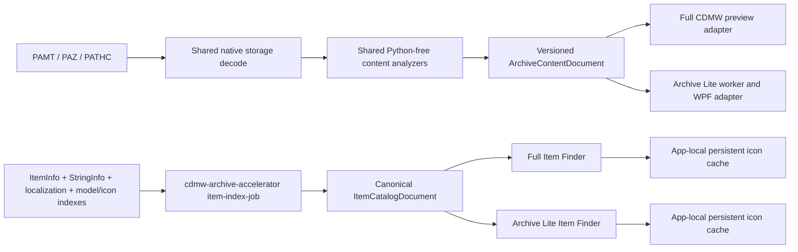

# Archive Decoder Parity And Archive Lite Item Finder

Updated: 2026-07-23

Status: IMPLEMENTED - SYNTHETIC FULL/LITE GATES PASS; REAL-CORPUS, VISIBLE, AND RELEASE GATES DEFERRED

Repositories: this full-workbench repository and the independent sibling
`D:\Byggverkstaden\CDMW Lite` repository.

Relocation note (2026-07-21): Archive Lite, its tests, and its complete build
dependency closure moved to the independent repository. The Lite repository
owns committed snapshots of the semantic library, schema, native helpers, and
.NET/Vortice renderer and rejects references back to this checkout. The two
products no longer share a worktree or source reference; future parity changes
must update both versioned contracts deliberately.

## Implementation outcome

The source audit below records the pre-implementation gaps. The implemented
state resolved them through a Python-free capability/document contract. Since
the repository split, each product owns its implementation snapshot rather
than importing the other product's source:

- Each repository's `schemas/archive_content_capabilities.v1.json` declares the role, group,
  analyzer, maturity, readable/structured/reference/visual/playback flags, and
  export capabilities for the audited extensions. The split began from the
  same manifest; coordinated version changes are now required to retain parity.
- This repository's manifest additionally carries per-extension decode progress
  (`origin`, `decode`, `write`, `priority`, `evidence`, `remaining`) and a derived
  `progress` summary block, described in `docs/features/format-decode-progress.md`.
  Those fields are additive and `schema_version` stays at `1`: `ArchiveContentRegistry`
  ignores unmapped members, so a Lite snapshot without them still loads. Parity is
  unaffected until Lite chooses to adopt them. The entry count moved from 107 to 108
  when `.paac` was added; an extension present in one product's manifest and absent
  from the other's is the parity risk to watch, not the extra fields.
- Each repository's `Cdmw.Archive.Content` project owns bounded normalized documents for text/XML,
  generic binary, MeshInfo, effect metadata (`.pae`/`.paem`), BNK, PATHC, PAB,
  HKX/HKT, and the audited structured sidecar families. Full and Lite adapters
  publish those documents without changing the archive source bytes.
- PAT now uses the native preview core for the supported LOD0 geometry path:
  bounds, quantized vertices/normals/UVs, 16-bit indices, draw ranges, and
  material candidates. Unknown layouts remain explicit instead of being
  mislabeled as decoded geometry.
- The native item indexers emit the same schema-versioned raw catalog contract
  in both repositories. Lite atomically caches the catalog beside
  its name maps and provides paged search, category/material facets, variant
  grouping, localized and secondary IDs, exact/related Archive Browser scopes,
  scope-specific extension facets, deterministic common-extension shortcuts,
  and persistent dialog state. Archive Browser filters and sorting refine an
  active item set until the explicit scope-only clear action restores global
  extension facets.
- Lite prepares persistent 120-pixel item thumbnails in the background. Visible
  rows have priority; foreground archive work pauses warmup; batches and decode
  concurrency are bounded; negative results have short TTLs; and the WPF image
  LRU is capped at 96. Rows publish once with cached/fallback icons before
  missing icons load asynchronously, so each current tile transitions at most
  once. A warm disk hit performs no archive decode or DirectXTex launch.
- Archive Lite launches the modal Item Finder from the top navigation and uses
  the same resizable `WindowChrome` and DWM theme owner as the main window. The
  view model owns one 220 ms latest-wins debounce; immutable facet replacement
  is suppressed from scheduling feedback searches.
- Full CDMW's remote-backend Item Finder now uses the same 72-row visual
  workflow: fallback-first icon cards, category and material facets, a
  selected-item evidence/detail pane, exact and related Archive Browser scope
  actions, and persisted query/filter/geometry state. It requests prepared
  icons in visible-first batches of at most 24, rejects stale conversion
  generations, and cancels outstanding requests and conversions on a newer
  search or dialog close. Material-specific browsing remains outside this Item
  Finder surface. Double-click resolves the item's exact links, selects a
  directly linked model when available, and starts the existing Archive Browser
  preview lane; related-set expansion remains an explicit button action.
  Ordinary archive publication and filtering leave the list unselected when
  there is no prior user selection to restore, so the first row never starts a
  preview on its own.
- Full's resident catalogue now also uses Lite's ordered category/group
  taxonomy rather than its earlier coarse `Equipment` classifier.
  Classification considers internal, display, localized, model, PAC, and icon
  naming evidence, preserves the `Item / Unclassified` fallback, and uses token
  boundaries so embedded text such as `password` does not become a `sword`.
  Saved filters from the retired Full taxonomy are mapped or cleared before
  startup warmup and dialog search so an upgrade cannot cache an empty page.
- Full now starts the catalogue and icon warmup immediately after archive
  publication instead of on the first Item Finder click. The restored 72-row
  page is cached for immediate open, selected/visible requests preempt the
  low-priority all-icon queue, DDS conversions are batched, and only 96 recent
  non-startup `QImage` values remain in the general memory LRU; durable PNGs
  remain the cross-session cache.
- `Cdmw.Archive.Content` owns the path-only terminal-suffix DDS usage rule.
  Lite presents `.dds` as File type **Texture** plus Color, Normal map,
  Material map, or explicit Unknown usage; a material-like word elsewhere in
  the asset name cannot override a terminal color suffix.

Synthetic validation completed on 2026-07-19:

- Archive Lite official Debug gate: PASS, 31 managed scenarios plus native
  archive/preview/accelerator/mesh/DirectXTex builds and self-tests. One first
  attempt hit the existing resident-renderer switch timeout; the scenario
  passed immediately afterward and the complete official gate then passed.
- Full archive backend Release gate: PASS, 10 scenarios plus native self-test.
- Full catalog/cache tests: 96 passed.
- Full decoder/contracts/structured-preview tests: 41 passed plus 2 subtests.
- Native archive accelerator Release build and protocol version check: PASS.

Focused validation for the Item Finder/classification follow-up on 2026-07-21:

- Archive Lite official Debug gate: PASS, 33 managed scenarios plus the native
  archive/preview/accelerator/mesh/DirectXTex builds and self-tests.
- Repository Archive area gate: PASS, 112 tests.
- Full archive Release native self-test, build, and the new shared
  `texture_usage_classification` scenario: PASS. The complete runner then
  stopped at two pre-existing dirty-baseline checks owned by the in-progress
  Full item-catalog protocol work (`ArchiveItemCatalogBuildService.cs` source
  independence and worker ping compatibility); those unrelated owners were not
  changed by this follow-up.

Focused Full classifier parity validation on 2026-07-23:

- Full archive backend Release gate: PASS, 14 managed scenarios including the
  new Lite category-parity fixture, plus the native self-test and headless
  worker/protocol probe.
- Full remote finder, warmup/lifecycle, Lite-parity UI, catalogue-service, and
  backend-contract tests: PASS, 31 tests.
- Licensed real-corpus and visible UI validation remained deferred.

Standalone-repository extraction validation on 2026-07-21:

- Independent Git root and source-containment guard: PASS.
- Archive Lite Debug gate from `D:\Byggverkstaden\CDMW Lite`: PASS, all 33
  managed scenarios plus fresh native/helper builds.
- Pinned vgmstream bootstrap: PASS for both cold installation and verified
  warm reuse.

The deferred gates remain intentionally outside this implementation: licensed
real-PAMT/PAC semantic coverage, real-corpus Item Finder completeness and
latency, visible renderer/game/Blender fidelity, and the Archive Lite Release
package/standalone verification. They require explicit corpus, visual, or
release authorization and must not be inferred from the synthetic results.

## Goal

Make Archive Browser decoding deterministic across full CDMW and CDMW Archive
Lite, then add an Item Finder to Archive Lite with the same catalog meaning and
user-facing workflow as full CDMW.

For every registered extension, the same decoded archive bytes must produce the
same normalized content document, confidence labels, references, and declared
preview/export capabilities in both applications. The UI toolkit may differ,
but a format must not silently become structured data in one application and
raw text or hex in the other.

Archive Lite must remain Python-free, read-only, responsive, and independently
packaged. Decoder parity does not include full CDMW's mutation or structured
editing tools.

## Non-negotiable constraints

- Keep PAMT, PAZ, and PATHC sources read-only. Derived JSON, images, thumbnails,
  model packages, and exports must publish outside the source archives.
- Do not port Python decoders into Archive Lite. Keep its repository-owned
  Python-free rules aligned through explicit schema/contract versions and
  coordinated compatibility tests in both repositories.
- Preserve uncertainty. Existing full-CDMW sidecar decoders recover candidate
  fields and relationships; they do not prove complete proprietary schemas.
  The versioned result contract must retain offsets, evidence, confidence, truncation, and
  `candidate` versus `proven` labels.
- Do not invent particle playback for PAE/PAEM or geometry for HKX/HKT when the
  source does not yield it. Unsupported views must fail closed with the same
  reason in both products.
- Keep expensive archive reads, decoding, indexing, thumbnail conversion, and
  search outside the Qt and WPF UI threads. Cancellation and generation checks
  must prevent stale publication.
- Keep Archive Lite's portable caches separate from full CDMW's caches even
  when both use the same cache schema and invalidation rules.
- Do not launch licensed-game, visible-renderer, or real-corpus validation
  without explicit authorization.

## What parity means

Parity is measured independently on these axes:

1. **Storage decode** - raw, compression, encryption, and partial-container
   handling produce the same bytes.
2. **Classification** - role, extension group, previewability, and capability
   flags come from one extension registry.
3. **Readable content** - the same summaries, sections, strings, fields,
   warnings, and truncation state are available.
4. **Structured output** - the same versioned read-only JSON document is
   available where full CDMW currently exposes structured inspection.
5. **Relationships** - exact references and heuristic family hints retain the
   same evidence and confidence.
6. **Visual or playback support** - both products use the same decoded model,
   image, audio, or video representation, or state the same limitation.
7. **Derived export** - raw export remains lossless; read-only JSON and
   interchange exports are offered only when their shared decoder supports
   them. Full-only editing/import remains outside Lite's scope.

Completion requires an explicit capability row for every extension in the
registry. A new extension added to only one product must fail parity tests.

## Current architecture and root cause

The default full-CDMW path is already hybrid: the resident .NET archive backend
prepares decoded bytes, then the Python preview layer supplies most structured
and format-specific meaning. Archive Lite uses a separate .NET worker after the
same kind of native byte decode, but its semantic layer is much smaller. This is
why raw extraction can agree while preview output does not.

The two .NET `ArchiveEntryClassifier` and `TextDecoding` implementations are
near copies under full and Lite. The native archive cores under
`native/cdmw_full_archive_core` and `native/cdmw_archive_core` are also parallel
implementations. That duplication is a continuing drift risk even before the
semantic decoders are considered.

The intended end state is:



## Baseline decoder audit (pre-implementation)

Legend:

- **Equivalent**: no semantic gap found in the source path, though fixture
  coverage may still need strengthening.
- **Partial**: both recognize the format, but content, metadata, relationship,
  visual, or export behavior differs.
- **Lite gap**: full CDMW has a materially richer read-only decode.
- **Both gap**: registration or routing is incomplete or misleading in both.
- **Full gap**: Archive Lite currently registers a useful format that full CDMW
  does not register equivalently.

### Storage and generic fallbacks

| Extension or family | Full CDMW today | Archive Lite today | Finding and required action |
| --- | --- | --- | --- |
| All entries: raw, LZ4, filename-derived ChaCha20 | Native byte decode | Native byte decode | **Equivalent behavior, duplicated owner.** Consolidate codec tests and either one native core or generated/shared sources so fixes cannot diverge. |
| Partial entries, including PATHC-backed DDS | Partial-container recovery | Partial-container recovery | **Partial.** Both cover the known DDS route, but common conformance fixtures must compare exact decoded hashes and error states. |
| Unknown binary extension | Readable-string extraction, header details, recognized-content hints, then hex | Hex only | **Lite gap.** Move bounded string/header/hint analysis into the shared content document. |
| Oversized preview | Format-specific bounded behavior varies | Blanket semantic decode refusal above 64 MiB after model attempt | **Partial.** Give analyzers explicit bounded-read policies so large metadata can still expose safe headers/sections without allocating the whole file. |

### Text and XML-like content

| Extension or family | Full CDMW today | Archive Lite today | Finding and required action |
| --- | --- | --- | --- |
| `.cfg`, `.css`, `.csv`, `.html`, `.h`, `.hpp`, `.ini`, `.json`, `.log`, `.lua`, `.material`, `.mtl`, `.paloc`, `.shader`, `.txt`, `.xml`, `.yaml`, `.yml` | Readable text plus simplified summaries and relationship extraction | Full text artifact, generally without the same semantic summary or references | **Partial.** Share encoding detection, syntax identity, simplified sections, exact references, and heuristic hints. |
| `.app_xml`, `.pac_xml`, `.pam_xml`, `.pamlod_xml`, `.pami`, `.prefabdata_xml` | Readable material/resource metadata with relationship handling | Readable raw text | **Lite gap.** Produce the same normalized material/resource/reference sections while retaining raw text. |
| `.obj`, `.dae`, `.gltf` | Text branch wins before model handling; OBJ also gets a structural summary | Classified as Model before Text; native visual support is absent, so the result is hex | **Lite routing bug.** The capability registry must distinguish textual model containers from binary visual support. |
| `.thtml` | Registered as text | Listed only by a category picker, not the Lite text-role set | **Lite routing bug.** Register once as text/UI content. |
| `.prefab_xml` | Missing from the Python full registry | Registered as Lite text | **Full gap.** Verify the suffix on corpus evidence, then add it to the shared registry or remove it from Lite if it is not real. |
| `.ui` | Filter-only alias; usually readable only when path heuristics happen to classify it | Filter-only alias; usually depends on `/ui/` path heuristics | **Both gap.** Confirm actual payloads, then register as text or remove the misleading capability. |

### Images and textures

| Extension or family | Full CDMW today | Archive Lite today | Finding and required action |
| --- | --- | --- | --- |
| `.bmp`, `.gif`, `.hdr`, `.jpeg`, `.jpg`, `.png`, `.tga`, `.tif`, `.tiff`, `.webp` | Qt image decode where supported | Windows image decode where supported | **Partial.** Registration matches, but codec availability and metadata are platform-handler dependent. Add one success/failure contract per extension and identical unsupported messages. |
| `.dds` | Rich DDS inspection, association/material context, image decode, and related references | DirectXTex PNG decode plus detailed DDS header metadata | **Partial in both directions.** Use one DDS metadata contract and the same DirectXTex-derived image rules; preserve full's relationship/material context. |
| `.texture` | Category-picker alias only unless path heuristics catch it | Category-picker alias only unless path heuristics catch it | **Both gap.** Prove the payload family before declaring it previewable. |

### Audio, video, and banks

| Extension or family | Full CDMW today | Archive Lite today | Finding and required action |
| --- | --- | --- | --- |
| `.mp3`, `.ogg`, `.wav` | Direct media preview | Direct Windows media preview | **Partial.** Normalize metadata, codec-unavailable errors, artifact identity, and reference handling. |
| `.wem` | Wwise-aware preview path and structured-content detection | Bundled vgmstream decode to cached WAV | **Partial in both directions.** Adopt the bundled deterministic decode for both while sharing WEM metadata and warnings. |
| `.bnk` | Structured soundbank preview before the text fallback | Classified as audio, but no bundled BNK decoder; falls to hex | **Lite gap.** Port the read-only bank table/string/reference decode into the shared analyzer; do not claim playable embedded events unless extracted safely. |
| `.mp4`, `.bk2` | Registered media preview; BK2 remains codec-dependent | Registered media preview; BK2 remains codec-dependent | **Partial.** Align metadata and failure text. Never claim BK2 playback merely because the extension is recognized. |
| `.aac`, `.flac`, `.m4a`, `.wma` | Not in the full registry | Registered as direct audio | **Full gap.** Use the capability union and add full support only where its media backend proves it can open the format. |
| `.avi`, `.m4v`, `.mov`, `.mpeg`, `.mpg`, `.webm`, `.wmv` | Not in the full registry | Registered as direct video | **Full gap.** Use the capability union with backend-specific availability checks and identical unsupported results. |

### Models, skeletons, and physics

| Extension or family | Full CDMW today | Archive Lite today | Finding and required action |
| --- | --- | --- | --- |
| `.pac`, `.pam`, `.pamlod` | Recovered geometry plus richer material, texture, skeleton, and relationship context | Native model package and resident Vortice clay preview; OBJ/GLB/FBX export | **Partial in both directions.** Define one decoded model/package contract and reference report. UI shading can differ, but geometry counts, LOD identity, materials, UV presence, references, warnings, and interchange availability must agree. |
| `.pat` | Real plant-mesh geometry decode: bounds, LODs, 32-byte vertices, UVs, 16-bit indices, draws, material/texture hints; visual preview and OBJ path | Classified as Model, unsupported by the native model service, then hex | **Lite gap.** Add PAT to the shared/native model package path and compare normalized geometry and draw tables against the existing Python decoder. |
| `.pab` | Read-only skeleton decode and preview | Classified as Model, unsupported by the native model service, then hex | **Lite gap.** Add a shared skeleton document and optional native visualization only when real hierarchy/transforms are recovered. |
| `.hkx`, `.hkt` | Rich Havok/container analysis and read-only JSON/XML views; archive browsing normally avoids automatic physics visualization | Safe basic container/SDK/tag metadata only, explicitly no fabricated geometry | **Partial.** Reuse the same native HKX analyzer and normalized document in both. Preserve Lite's no-synthesis rule and keep full editing/import out of Lite. |
| `.3ds`, `.fbx`, `.glb`, `.mesh`, `.mdl`, `.model`, `.patx` | Registered as models but no archive visual decoder; generic strings/header may still be readable | Registered as models but unsupported native visual path; hex | **Both gap.** Either add a proven shared decoder or mark each as readable-binary/raw-export only. Registration must not imply a visual decoder. |

### Animation, effect, and sequence sidecars

| Extension or family | Full CDMW today | Archive Lite today | Finding and required action |
| --- | --- | --- | --- |
| `.paa`, `.paa_metabin` | Heuristic animation metadata, timing/track markers, strings, references, structured JSON | Animation role followed by hex | **Lite gap.** Port the bounded read-only analyzer and preserve candidate labels. |
| `.pae`, `.paem` | Heuristic effect/emitter metadata and readable markers; no particle/timeline playback | Animation role followed by hex; category picker incorrectly places `.pae` under model/mesh/physics | **Lite gap plus shared classification bug.** Share the effect document and explicitly report that playback is unavailable. |
| `.motionblending` | Structured sidecar preview and relationship extraction | Animation role followed by hex | **Lite gap.** Share the document and references. |
| `.paseq`, `.paseqc`, `.paschedule`, `.paschedulepath`, `.pastage` | Structured sequence/schedule preview and JSON | Animation role followed by hex | **Lite gap.** Share the read-only decode. The picker typo `.paseqcpath` must become `.paschedulepath`; missing sequence extensions must be added. |
| `.papr` | A dedicated analyzer exists, but the main full preview branch omits `.papr`, so normal preview falls through to generic binary handling | Animation role followed by hex | **Both routing gap.** Wire the existing semantics through the shared analyzer and both products. |
| `.ani`, `.pai`, mistaken `.paseqcpath` | Category-picker entries without a matching decoder/role | Same misleading category-only entries | **Both gap.** Validate against real extension counts; map real formats or delete phantom registrations. |

### Structured metadata and scene sidecars

| Extension or family | Full CDMW today | Archive Lite today | Finding and required action |
| --- | --- | --- | --- |
| `.meshinfo` | Read-only heuristic MeshInfo document: declared field/type rows, field-like strings, references, container family, layout signature, candidate offsets/count pairs/float vectors, header, physics/collision/bounds/breakable/tree/socket grouping, and JSON export | Metadata role is sent to generic text decoding, which can display binary noise | **Highest-priority Lite gap.** Port the exact normalized read-only document first. Do not present inferred offsets or vectors as a proven schema. |
| `.prefab`, `.pappt`, `.pamhc`, `.paccd`, `.seqmt` | Specialized structured summary, strings, references, and JSON analysis | Metadata role followed by generic text decoding | **Lite gap.** Share specialized sections and evidence. |
| `.levelinfo`, `.palevel`, `.roadsector`, `.road`, `.nav` | Specialized world/level/road/navigation summary and references | Metadata role followed by generic text decoding | **Lite gap.** Share bounded documents; keep large-file scanning cancellable and sampled. |
| `.pabc`, `.pabv`, `.pabgb`, `.pabgh` | Specialized descriptor/table summaries; some ItemInfo table recovery | Metadata role followed by generic text decoding | **Lite gap.** Share table/evidence documents. Safe structured editing remains full-only. |
| `.pathc` | Dedicated PATHC metadata/relationship preview | Metadata role followed by generic text decoding | **Lite gap.** Share the PATHC content document separately from storage-level partial reads. |
| `.uianiminit` | Recognized for structured payload detection and metadata role but omitted from the specialized preview branches; generic fallback | Metadata role followed by generic text decoding | **Both routing gap.** Add a real shared analyzer or honestly expose generic binary analysis. |
| `.binarygimmick`, `.pagbg`, `.pampg` | Recognized during structured-payload detection, but not consistently assigned a role or routed to a specialized preview | Missing or category-only; falls to raw fallback | **Both gap.** Establish corpus-backed schemas or downgrade them to explicit generic-binary support. |

### Classification and capability drift independent of decoding

The following must be fixed before adding more individual decoders:

- Full and Lite have copied C# classifiers, while full Python has separate
  constants, role rules, UI filters, and preview branch order.
- Textual model formats are members of both Text and Model sets; Lite checks
  Model first while full's semantic preview checks Text first.
- `.pae` is incorrectly grouped with model/mesh/physics in both C# category
  code and the full Qt extension picker.
- `.paa_metabin` and `.motionblending` are placed in metadata before the
  animation group in some pickers, while their role/preview logic says
  animation.
- `.palevel` is treated as metadata by the role rules but animation/scene by
  one category list.
- `.papr`, `.paseq`, `.paschedule`, and `.paschedulepath` are missing from some
  picker groups even though role code recognizes them.
- `.binarygimmick`, `.pagbg`, `.pampg`, `.uianiminit`, `.texture`, `.ui`,
  `.ani`, and `.pai` have inconsistent role, picker, and preview registration.
- `.thtml` exists in the Python text registry but not the C# text-role set;
  `.prefab_xml` has the inverse mismatch.

### Audit conclusion

Storage-byte parity is substantially present, but semantic parity is not. The
largest Lite gaps are MeshInfo, the structured animation/effect and metadata
families, BNK/PATHC, PAT, PAB, richer HKX, relationship extraction, and the
generic readable-binary fallback. There are also problems worth fixing for
both products: copied classifiers, misleading filter-only extensions, the
`.papr` routing omission, inconsistent media registries, and duplicated native
archive codec owners.

MeshInfo is feasible in Archive Lite. The existing full decoder is bounded,
read-only byte analysis rather than a Python-only rendering feature. Its output
can move into the shared library as a readable document and stable JSON without
adding Python or enabling edits. It must continue to label recovered offsets,
counts, vectors, and field-like strings as candidates where the schema is not
proven.

## Shared decoder design

### 1. One capability manifest

Add a versioned manifest, proposed as
`schemas/archive_content_capabilities.v1.json`, with one row per extension and:

- canonical extension and aliases;
- role and picker group;
- textual versus binary container;
- storage decode policy;
- analyzer identifier;
- readable, structured, reference, visual, playback, and export capabilities;
- maximum-read/sampling policy;
- confidence policy and unsupported reason;
- feature maturity: `proven`, `heuristic`, `header-only`, or `raw-only`.

Embed or generate immutable lookups from that file for the shared .NET library,
full Python, full .NET backend, and Lite. Tests must reject hand-maintained
extension literals in routing owners unless explicitly exempted.

### 2. One normalized content document

Create a product-neutral `net10.0` project, proposed as
`tools/dotnet_archive_backend/src/Cdmw.Archive.Content`, referenced by both .NET
cores. Its `ArchiveContentDocument` must contain:

- schema/analyzer versions, extension, content kind, and source byte length;
- title, summary, named sections, rows, and bounded readable strings;
- typed values with byte offsets/ranges where known;
- exact references and heuristic hints as separate collections;
- evidence, confidence, provenance, and candidate/proven state;
- truncation, unsupported, corruption, and decoder warnings;
- declared visual/playback/export representations;
- stable normalization rules for golden comparisons.

Pure parsers operate on `ReadOnlySpan<byte>` or bounded streams and do not know
about WPF, Qt, archive sessions, paths on disk, or UI state.

### 3. Product adapters, not product decoders

- Extend the full .NET archive backend preview preparation contract so it can
  publish the normalized document beside the decoded artifact. The Python
  Archive Browser renders that document through a thin adapter.
- Archive Lite's worker invokes its repository-owned build of the same
  versioned document contract and publishes large text/JSON documents as
  bounded cache artifacts rather than oversized named-pipe messages.
- Keep current Python structured decoders temporarily as a golden oracle and
  compatibility fallback. Every migrated analyzer needs normalized fixture
  equality before the versioned result becomes authoritative.
- A fallback must identify itself in diagnostics. Never silently show two
  different interpretations under the same feature name.

### 4. Native specialization where JSON is the wrong transport

- Extend `cdmw_preview_core` for PAT and PAB package generation so vertex/index
  or hierarchy data does not travel through JSON. Both products consume the
  same immutable package and a small normalized report.
- Reuse the native `cd_hkx` analyzer for the shared HKX/HKT document; package it
  with Lite without introducing Python.
- Keep DirectXTex and vgmstream as shared deterministic image/audio helpers.
- Consolidate the two archive native cores or generate them from one codec
  owner, retaining separate exported DLL names only if packaging requires it.

## Archive Lite Item Finder design

### Existing reusable foundation

Archive Lite already builds its known-name index after archive open. Its
`ArchiveItemNameIndexService` extracts the same ItemInfo, StringInfo,
PartPrefabDyeSlotInfo, localization, model, and icon sources, then invokes
`cdmw-archive-accelerator item-name-map-job`.

That native command calls the same implementation as `item-index-job` with
item-row output disabled. The full report already knows:

- item ID, internal name, display name, and localized names;
- prefab hashes, model stems, and PAC filenames;
- icon paths and material tags;
- exact and related model-name maps;
- source counts for model hashes, icons, and materials.

Name-map recovery keeps direct prefab-hash matches separate from inferred
evidence. It accepts bounded multi-prefab ItemInfo lists, recovers localization
IDs near the documented field when record layouts shift, and admits StringInfo
icon/model links only when item-name semantics remain compatible. Related names
also propagate to recognizable item-icon, texture-family, component, and
sidecar filenames. The Archive Browser renders the direct name when available,
otherwise the recovered related name, in one **Item Name** column. Exact and
inferred mappings remain separate in the underlying contract, and the cell
tooltip identifies the confidence without spending a second table column on it.

Lite therefore does not need a second archive scan. It needs to retain and
serve data it already computes.

### Canonical catalog contract

1. Version `item-index-job` and extend it to publish the final canonical catalog
   row used by both products, including category, group, category evidence,
   variants, scope, table evidence, and compatibility tags.
2. Move or encode the current full-CDMW category/group rules in this shared
   owner. Keep the Python fallback only while golden parity tests cover every
   category and grouping rule.
3. Change Lite's name-index build to request item rows, bump its cache schema,
   and store the catalog beside the existing exact/related name maps under the
   archive fingerprint and helper/schema identity.
4. Add worker operations for paged/filterable catalog queries and batched icon
   preparation. Do not send the whole catalog or image bytes in one protocol
   response.
5. Reuse Lite's existing archive query and association services for **Show
   Exact Links**, **Show Related Set**, **Show in browser**, and raw export.

### WPF Item Finder parity surface

The implemented modal WPF Item Finder is launched from the top navigation and
matches full CDMW's functional layout rather than copying Qt implementation
details:

- search across display/localized names, internal ID, model/PAC stem, category,
  group, material tag, texture/reference, and icon path;
- category/group tree with counts and an All Items root;
- virtualized icon grid with display name and immediate fallback glyph;
- details for IDs, category evidence, grouped variants, material tags, model
  and PAC links, icon paths, scope, and table evidence;
- **Show Exact Links**, **Show Related Set**, **Show in browser**, and **Open
  Icon** actions;
- double-click loads the exact item into the normal Archive Browser preview,
  preferring a directly linked model and falling back to another previewable
  direct link;
- persisted window size/position, splitter sizes, category/group, search,
  selection, and scroll position where stable;
- English, German, and Spanish resources in the existing localization system;
- theme, font-size, density, keyboard navigation, and accessibility behavior
  consistent with the rest of Archive Lite.

Use WPF data virtualization or paging. Do not construct thousands of item-card
controls at once. Search/filter work belongs in the worker or a bounded indexed
view, not a linear dispatcher-thread rebuild.

The Archive Browser keeps two immutable extension universes: archive-wide
facets and the active Item Finder scope facets returned with
`ItemCatalogScopeResult`. Search, extension, path, role, and sorting never drop
the active entry-ID scope. **Clear item set** removes only that scope, preserves
the current filters, and republishes archive-wide facets. **Most common** lists
All files plus at most ten extensions from the active universe, ordered by
count descending and then extension name.

### What "icons are pre-loaded and quick" means

Pre-loading means all known item icons can be converted into durable 120-pixel
PNG thumbnails in low-priority background work after the catalog is ready. It
does **not** mean decoding every bitmap into RAM at startup.

The Lite icon pipeline must:

1. Show fallback category icons immediately.
2. Read persistent thumbnail hits before any source extraction or DirectXTex
   launch.
3. Give selected, visible, and near-visible rows priority over the background
   preload queue.
4. Convert DDS icons through one batched DirectXTex job where practical; copy or
   resize already-readable PNG icons through the worker.
5. Key each thumbnail by archive fingerprint, exact source-entry identity,
   analyzer/converter identity, requested maximum dimension, and cache schema.
6. Publish PNG plus manifest atomically, reject damaged entries, and prune only
   bounded app-owned cache paths.
7. Single-flight duplicate requests, use bounded concurrency/batches, and keep
   a short negative-cache TTL for failed icons.
8. Return frozen WPF `BitmapSource` objects to the UI and keep only a bounded
   memory LRU for visible/recent sizes.
9. Carry archive-session and request generations through every batch; closing
   the dialog, changing archives, or shutting down cancels work and rejects
   stale results.
10. Yield to foreground preview, search, and export operations. Background
    preload must never make Archive Browser interaction slower.

Full CDMW's existing persistent thumbnail, visible-first priority, background
batch, generation, and negative-cache behavior becomes the parity oracle. Its
cache should adopt the same manifest fields and instrumentation while retaining
Qt `QImage`/`QPixmap` ownership on the UI thread.

Warm-path acceptance requires:

- opening the Item Finder from a valid cached catalog does not rerun the native
  item indexer;
- displaying a cached icon performs no archive decode and launches no texture
  converter;
- initial rows and fallback icons paint without waiting for thumbnail warmup;
- cached visible icons replace fallbacks in bounded UI batches;
- measured catalog-open, search, and first-visible-icon latency is recorded for
  both products on the same synthetic corpus, with no regression against full
  CDMW's current warm path;
- an authorized real-corpus performance gate sets final machine-specific p50
  and p95 budgets before release rather than inventing unverified timings here.

## Implemented phases

### Phase 0 - Freeze the contract and parity harness

- Add the capability manifest and normalized document schema.
- Add a registry-union test covering every extension listed in this audit,
  including filter-only aliases and unsupported declarations.
- Build synthetic/golden fixtures from existing full decoders for text, generic
  binary, MeshInfo, PAE, PAT, BNK, PATHC, PAB, HKX, and each structured family.
- Compare exact storage-byte hashes separately from semantic normalization.
- Record current full and Lite behavior as baseline; expected failures are
  explicit rows, never skipped tests.

Exit gate: both products load the same manifest, every extension has a declared
capability row, and the harness reports the audited gaps deterministically.

### Phase 1 - Shared routing, text, generic binary, and MeshInfo

- Introduce `Cdmw.Archive.Content` and wire both .NET cores to it.
- Replace copied classifier decisions with generated/shared manifest lookups.
- Fix `.obj`/`.dae`/`.gltf`, `.thtml`, picker grouping, and typo/phantom routes.
- Implement shared text encoding, bounded strings/header analysis, simplified
  summaries, and evidence-bearing references.
- Port MeshInfo first, publish readable and JSON artifacts in Lite, and make
  full consume the same normalized document.

Exit gate: MeshInfo parity is green; textual models are readable in Lite; every
generic binary fallback shows the same bounded facts and warnings.

### Phase 2 - Structured sidecars and banks

- Port the animation/effect family, including the missing `.papr` route.
- Port prefab/material/world/road/navigation/descriptor table families.
- Port BNK and PATHC structured documents.
- Resolve `.uianiminit`, `.binarygimmick`, `.pagbg`, and `.pampg` with either a
  corpus-backed analyzer or an honest shared generic-binary declaration.
- Expose read-only JSON decode export in Lite for the same supported sidecars.

Exit gate: normalized documents, references, candidate labels, truncation, and
corrupt-input behavior match full for every structured extension row.

### Phase 3 - Model, skeleton, HKX, image, and media convergence

- Add PAT and PAB to the native preview/package path with Python-oracle goldens.
- Normalize PAC/PAM/PAMLOD reports and interchange availability across products
  without forcing full and Lite to use identical presentation shading.
- Adopt the shared HKX/HKT analyzer in Lite with no synthesized geometry.
- Normalize DDS metadata and DirectXTex behavior.
- Use vgmstream consistently for WEM and reconcile the broader Lite media list
  with full through actual backend capability checks.
- Downgrade registered-but-unsupported model/media formats to explicit
  raw/header-only capability until a decoder is proven.

Exit gate: geometry/table hashes and counts match on synthetic fixtures; every
visual/playback/export support decision and failure reason agrees.

### Phase 4 - Canonical Item Finder data

- Version and extend `item-index-job` to publish canonical catalog rows.
- Make full CDMW consume canonical category/group/evidence rows and retain its
  Python fallback behind parity tests.
- Change Lite from `item-name-map-job` to the full item report without another
  archive scan; bump and atomically migrate/rebuild its name/catalog cache.
- Add paged search/filter/detail worker contracts and exact cancellation tests.

Exit gate: both products return the same normalized item rows, grouping,
variants, evidence, exact links, and related hints for the synthetic catalog.

### Phase 5 - Archive Lite Item Finder and icon pipeline

- Add the WPF dialog/view model and Archive Browser command without making
  `MainWindow.xaml.cs` or `MainWindowViewModel` the feature owner.
- Add virtualized/paged grid behavior, details/actions, settings, resources,
  themes, and keyboard/accessibility coverage.
- Add persistent icon manifests, DirectXTex batch conversion, visible-first
  scheduling, low-priority full preload, memory LRU, cancellation, and stale
  generation rejection.
- Instrument cache hits, archive reads, converter launches, queue depth, and
  first-visible-icon latency for tests and diagnostics.

Exit gate: a synthetic archive exercises the real worker process, cached and
cold catalog paths, priority inversion, cancellation, damaged-cache recovery,
and clean shutdown while source hashes remain unchanged.

### Phase 6 - Cross-product stabilization and rollout

- Run focused full, Lite, native, and architecture gates after each owning
  phase; fix regressions before widening.
- Run the full Archive Browser and Archive Lite synthetic gates.
- Update architecture, feature docs, Archive Lite README/TESTING, package
  manifests, and the test matrix only when implementation changes land.
- With explicit authorization, run representative real-corpus semantic and
  performance audits. Keep visible renderer/game validation a separate gate.
- Remove compatibility decoders only after normalized parity, packaging, and
  rollback evidence are green.

Exit gate: no audited extension has an undeclared or product-specific semantic
path, Item Finder functional parity is green, Lite remains Python-free, and
both products preserve archive bytes.

## Implemented ownership map

| Area | Primary paths |
| --- | --- |
| Capability/document schema | `schemas/archive_content_capabilities.v1.json`, new `tools/dotnet_archive_backend/src/Cdmw.Archive.Content/` |
| Full backend transport | `tools/dotnet_archive_backend/src/Cdmw.FullArchive.Contracts/`, `Cdmw.FullArchive.Core/`, `Cdmw.FullArchive.Worker/` |
| Full Python adapters/oracles | `cdmw/core/archive_preview_result_builder.py`, `cdmw/core/archive_structured_preview.py`, binary preview helpers, `cdmw/core/pat_decoder.py` |
| Lite semantic worker | Independent `CDMW Lite` repository: `src/Cdmw.ArchiveLite.Contracts/`, `src/Cdmw.ArchiveLite.Core/`, `src/Cdmw.ArchiveLite.Worker/`, and `src/Cdmw.Archive.Content/` |
| Full model/HKX helpers | This repository's `native/cdmw_preview_core/`, `native/cd_hkx/`, DirectXTex and vgmstream integrations |
| Versioned item-catalog contract | This repository's `native/cdmw_archive_accelerator/` and `cdmw/core/item_index.py`; independent Lite copies under its `native/` and `src/` trees |
| Full Item Finder parity oracle | `cdmw/ui/archive_browser/asset_catalog_dialog.py`, `icon_pipeline.py`, `cdmw/workers/archive_workers.py`, `cdmw/core/archive_scan_cache.py` |
| Lite Item Finder UI | Independent `CDMW Lite` repository under `src/Cdmw.ArchiveLite.App/Dialogs/`, `ViewModels/`, and `Services/`; thin launch wiring only in its main shell |

## Validation record and remaining gates

All synthetic tests use the project virtual environment where Python applies
and system-temporary output. The validation order follows the owning-area
matrix rather than jumping directly to broad release gates.

### Per-decoder focused gates

Add and run targeted tests for:

- manifest completeness, classifier parity, and branch reachability;
- exact normalized content documents and malformed/truncated inputs;
- full-backend versus Lite-worker results from the same decoded bytes;
- source-byte SHA-256 immutability;
- cancellation, bounded reads, atomic artifact publication, and stale rejection;
- PAT/PAB geometry or hierarchy package hashes where applicable;
- structured JSON serialization stability and confidence/evidence preservation.

Existing focused anchors include:

```powershell
.\.venv\Scripts\python.exe -m pytest tests/test_archive_binary_preview_decomposition.py tests/test_archive_binary_preview_helper_decomposition.py tests/test_archive_structured_asset_preview.py
.\.venv\Scripts\python.exe -m pytest tests/test_archive_preview_decomposition.py tests/test_archive_preview_texture_binding.py
.\.venv\Scripts\python.exe -m pytest tests/test_hkx_preview.py tests/test_hkx_native_backend.py
```

### Item Finder and icon gates

```powershell
.\.venv\Scripts\python.exe -m pytest tests/test_item_name_archive_search.py tests/test_archive_caches.py tests/test_archive_relationships.py tests/test_archive_browser_asset_understanding_ui_source_guards.py
```

Lite managed tests cover catalog cache schema/fingerprint behavior, paged
search, grouping, exact-versus-related evidence, scope-specific extension
counts, deterministic common-extension ordering, icon cache identity,
persistent hits, DirectXTex batch counts, visible-priority ordering,
cancellation, stale generation rejection, bounded memory, settings,
localization, and a real named-pipe worker round trip. The WPF regression drives
the real debounce and verifies category/programmatic-facet behavior, one icon
transition, rapid changes, session invalidation, and dialog close.

### Product gates

```powershell
.\tools\dotnet_archive_backend\scripts\test_full_archive_backend.ps1 -Configuration Release
.\scripts\codex_check.ps1 -Area archive
```

Run the independent Lite product gate from `D:\Byggverkstaden\CDMW Lite`:

```powershell
.\scripts\test_archive_lite.ps1 -Configuration Debug
```

When `cdmw_preview_core` changes, also run its focused native build/self-test
from `docs/test-matrix.md` before the product gates.

### Deferred authorization gates

Do not run these merely to implement a phase:

- the independent `CDMW Lite` repository's `scripts/build_archive_lite.ps1`
  and final standalone
  artifact verification;
- licensed real-PAMT/PAC extension coverage and semantic parity;
- real-corpus Item Finder cold/warm p50 and p95 measurements;
- visible renderer, Blender, or game fidelity checks.

The Item Finder chrome is covered structurally/headlessly. Confirming the
reported outer top-edge artifact is gone is visual desktop evidence and remains
outside the synthetic gate until explicitly authorized.

They require explicit release, real-corpus, or visual-validation scope. Passing
synthetic tests must not be described as proof for proprietary corpus variants
or visible fidelity.

## Definition of done

- The capability manifest contains every audited extension, and all product
  registries are generated from or checked against it.
- The same input bytes produce byte-for-byte equivalent normalized content JSON
  after excluding explicitly nondeterministic timing/path fields.
- MeshInfo is readable and exportable as read-only decode JSON in Lite with the
  same candidate/proven semantics as full.
- PAT, PAE/PAEM, PAB, HKX/HKT, BNK, PATHC, text/XML, generic binary, and all
  listed structured sidecars have either shared support or the same explicit
  unsupported declaration.
- Full and Lite no longer contain independently drifting classifier or semantic
  decoder decisions.
- Both Item Finders consume the same canonical catalog and expose equivalent
  search, grouping, details, exact links, related hints, icon opening, and
  Archive Browser scoping.
- Item icon thumbnails are persistently prepared in the background, visible
  rows win priority, warm hits do no archive/converter work, and memory remains
  bounded.
- Archive Lite packages no Python runtime or Python-linked binary.
- All synthetic gates pass, source archive hashes remain unchanged, and any
  unrun real-corpus/visual/release gate is reported honestly.
